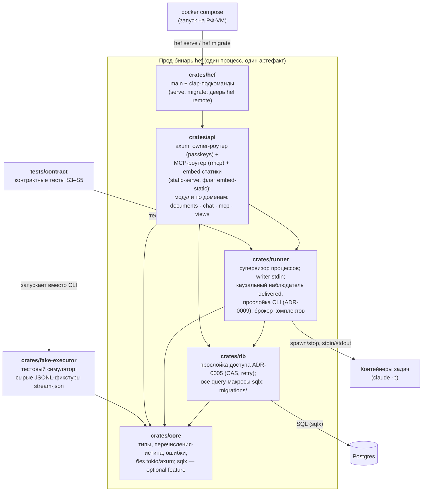

# C4 (component): бинарь `hef` — крейты workspace (ADR-0014)

L3: внутренняя организация одного контейнера (прод-бинаря). Крейт = компонент; граф зависимостей — конституция ADR-0014 (→ = зависит от). `fake-executor` — тестовый бинарь, в прод не попадает; показан для полноты workspace.

Заземлено в ADR-0014 (граф, границы крейтов, модульность `api`) и ADR-0005/0007/0009 (содержимое `db`/`runner`). CI-сторож чистоты `core` (без tokio/axum/sqlx в дефолтном графе) — часть конструкции, на диаграмме не показан. Фронт (`web/`) на этом уровне — источник статики для embed, не компонент бинаря.
