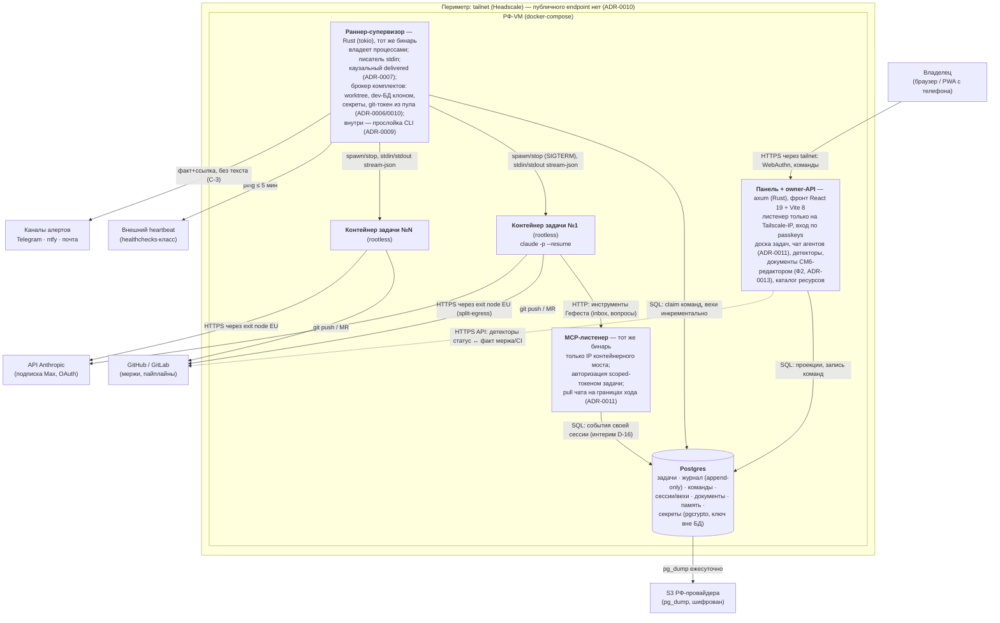

# C4 (container): Гефест — оркестратор Claude Code-агентов

Состояние: цель после Ф1–Ф2 (ADR-0001), обновлено под ADR-0006…0010. Прослойка CLI — модуль внутри раннера (L3, на container-уровне не выделяется). Топология хостов и сети — `deployment-perimetr.md`; здесь — приложение.

Panel, MCP и Runner — один деплоймент-юнит (один Rust-бинарь, ADR-0004); показаны раздельно, потому что слушают разные интерфейсы и несут разные поверхности доверия. Внутренняя организация бинаря по крейтам — `c4-component-binar.md` (ADR-0014).
