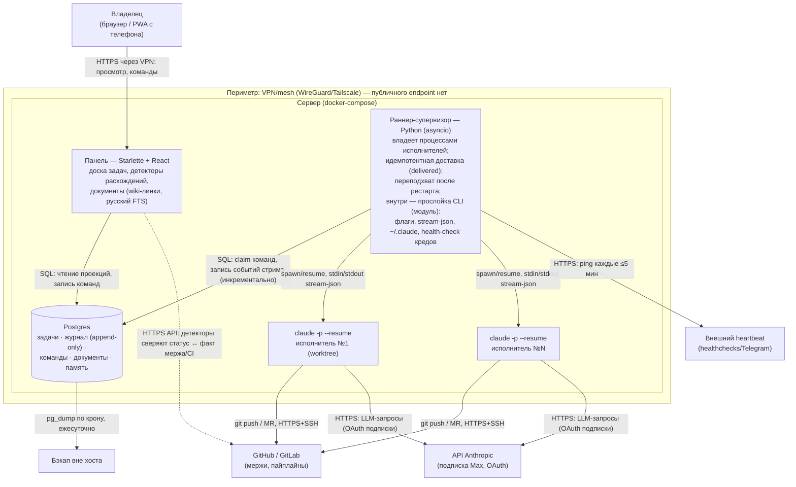

# C4 (container): Гефест — оркестратор Claude Code-агентов

Состояние: цель после Ф1–Ф2 (ADR-0001). Обновлять при изменении топологии. Прослойка CLI — модуль внутри раннера (компонент L3, на container-уровне не выделяется).

