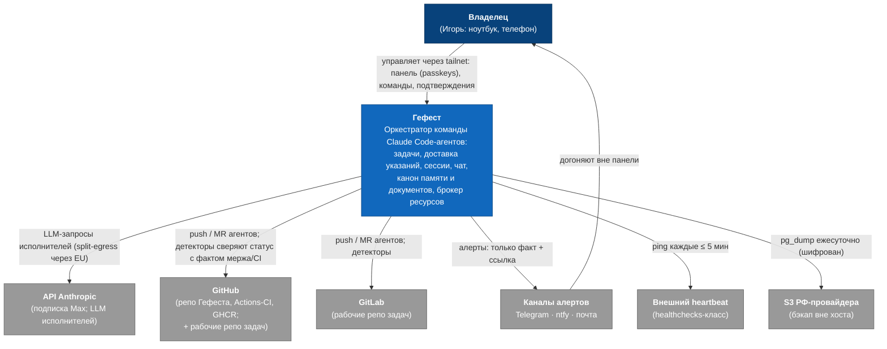

# C4 (context): Гефест в мире

L1: система и её окружение. Внутренности — `c4-container-orkestrator.md`; хосты и сеть — `deployment-perimetr.md`.

Заземлено в ARCHITECTURE.md и ADR-0007/0010/0011/0012; GitHub несёт три роли одного вендора (репо+CI+GHCR — ADR-0012/0014). Исполнители — внутри системы (контейнеры Гефеста), поэтому на L1 не показаны.
