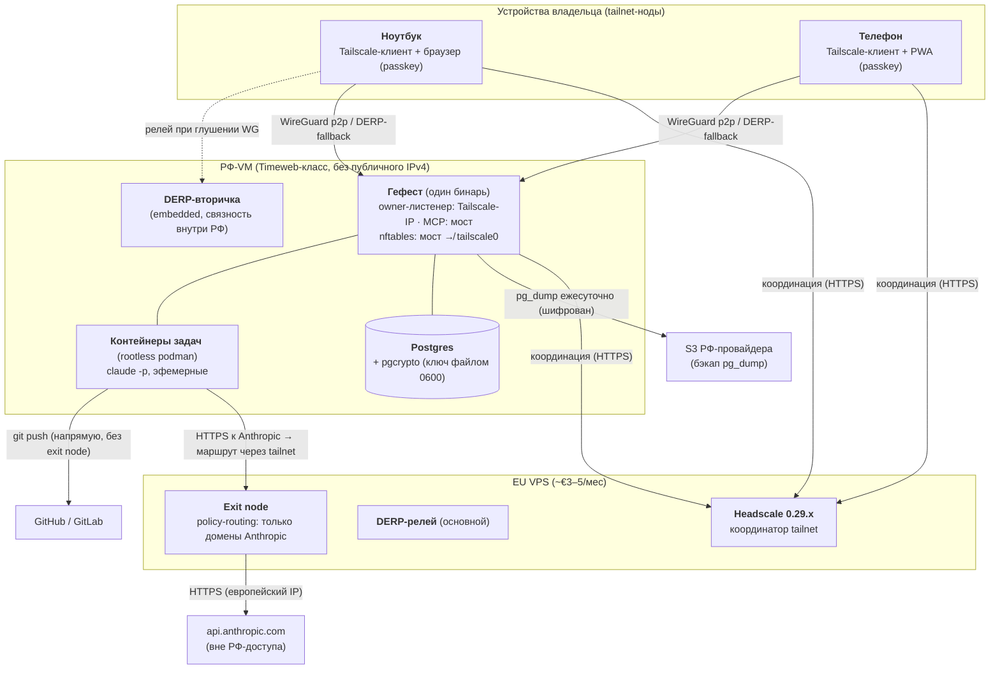

# Deployment: периметр Гефеста — два хоста, tailnet, split-egress (ADR-0010)

Что где запущено и как соединено. Логика приложения — `c4-container-orkestrator.md`.

Заземлено в ADR-0010; курсивных домыслов нет. Аварийный путь (SSH/консоль провайдера при падении tailnet) и алерт-каналы не показаны, чтобы не перегружать вид — они в ADR-0010. Падение EU VPS: существующие tailnet-связи живут (ключи у клиентов), теряются Anthropic-egress и приём новых нод — восстановление по снапшоту (GF-3/GF-6).
