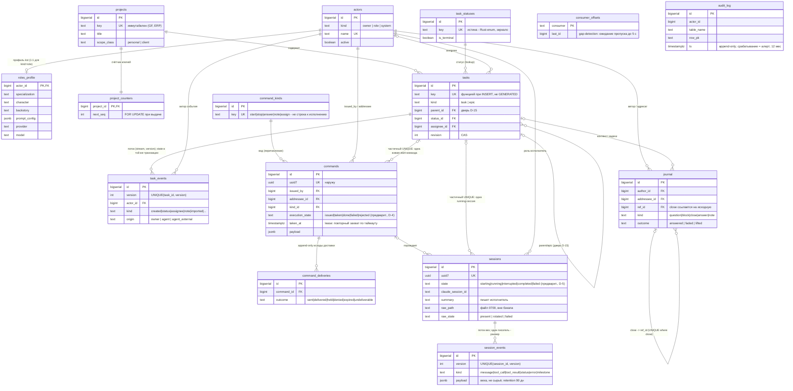

# ER: v1-ядро схемы Гефеста (ADR-0005)

Основание: ADR-0005 + decision ред. 2 §1 (нормативный эскиз). Показано **только v1-ядро** (14 таблиц + audit_log). Волна 2 — memory_* (6 таблиц, ADR-0003), boards/board_columns, pools/pool_tasks, tags/task_tags, task_dependencies, observations, exports_log — заведомо за кадром (двери в tasks: parent_id, column_id). Атрибуты сокращены до несущих; полный DDL — GF-5.

**Всё в диаграмме — из ADR-0005/decision ред. 2, ничего не выведено домыслом.** RLS+FORCE действует на все таблицы ядра; журнальные (task_events, session_events, command_deliveries, journal, audit_log) — append-only триггер-запретами; BRIN по монотонным PK журналов; ключ будущего партиционирования session_events включён в PK заранее.

Смежные виды: машина состояний команды/сессии — `/architect:diagram state` после D-4/D-5 (значения предварительные); поток доставки — `/architect:diagram sequence` после D-4.
