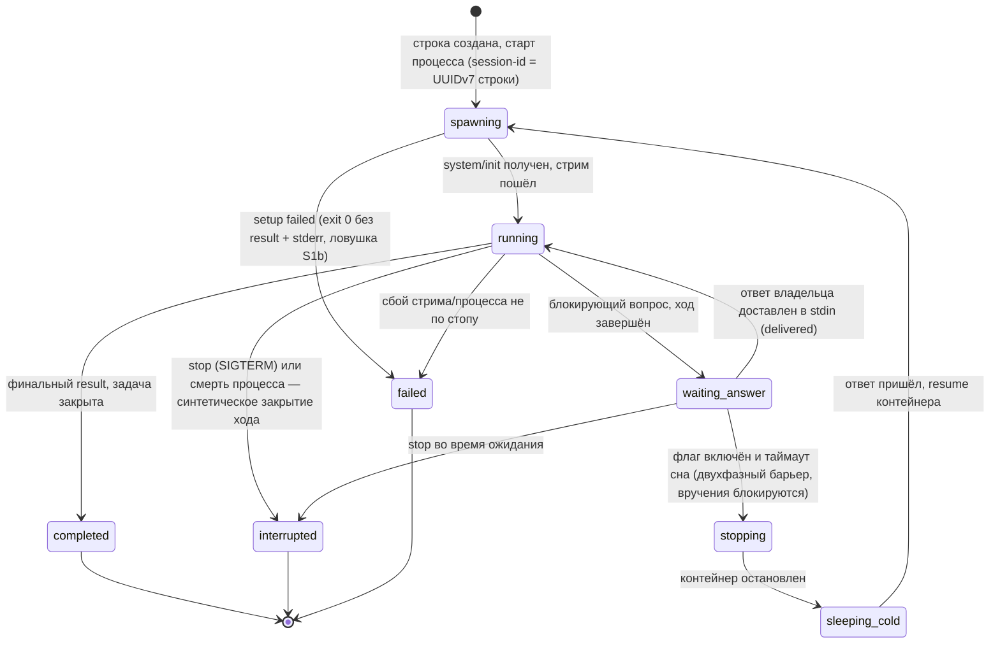

# State: сессия исполнителя (ADR-0008)

Один субъект — строка sessions. Переводит только раннер; каждый переход — событие session_events. Состояния `stopping`/`sleeping_cold` — за флагом стопа-по-таймауту (выключен в v1, включается при >2 одновременно спящих — ADR-0007 CC-3). Ретрай порождает **новую** сессию с `parent_session_id` — это не переход, а новая машина.

Заземлено в ADR-0007/0008: reconciliation при старте бинаря переводит осиротевшие `spawning`/`running` в `interrupted` событием (не отдельная стрелка — тот же переход «смерть процесса»); `failed` запускает ретрай-путь (в v1 — один авто-ретрай новой сессией → `paused` задачи + инцидент).
