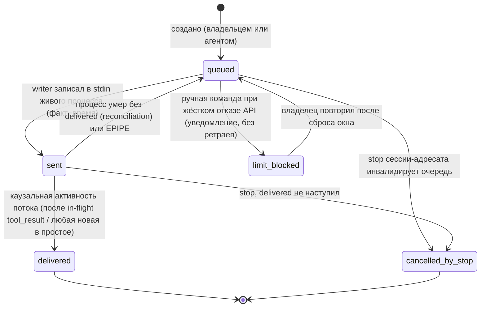

# State: указание (доставка, ADR-0007)

Один субъект — указание инбокса (вид `command`; `message` живёт в `queued` без эскалации до пробуждения адресата). Исходы — append-only записи `command_deliveries`; полный список терминальных исходов — артефакт GF-2 в границах «не уже ADR-0005» (здесь — ядро).

Заземлено в ADR-0007. Каузальность delivered: при mid-turn-записи считается только активность, начавшаяся **после** `tool_result` инструмента, который был in-flight на момент записи; при записи в простое — любая новая активность; error-события не подтверждают. Перекладка `sent → queued` — выбор «дублируем, не теряем», дедуп вручений раннером по uuid. Таймаут наблюдателя delivered — настройка `delivery_confirm_timeout`; `requires_ack`-дверь (delivered требует `inbox_ack`) в v1 — решение без кода, на диаграмме отсутствует умышленно. Ось исполнения (`execution_state`: issued/taken/done/failed) — отдельная машина, не смешана (ADR-0005: оси разделены).
