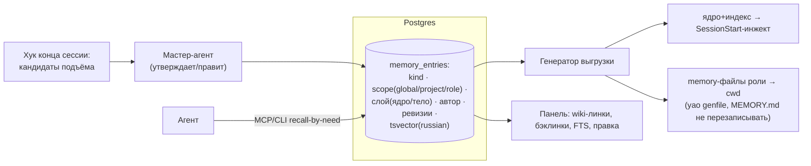

# Design: канон памяти Гефеста (D-8) — альтернативы

- Дата: 2026-08-20
- Фаза: Design (deep-цикл)
- Входы: discovery (`2026-08-20-kanon-pamyati.md`, 2 раунда: Р-1 трёхслойный recall, C-П1 мастер-агент-редактор, C-П2 память ролей first-class, F-П6 мост «роль → cwd»), research (`...-kanon-pamyati-research.md`: EverOS вычеркнут тремя блокерами, идеи забраны)

## 1. Проблема и силы

Нужен канон знаний и памяти команды: learnings/правила/ловушки, справочники, карточки, дневники, память 11 ролей — один хозяин, русский поиск (С7), трёхслойный recall (ядро/индекс/тело — Р-1), гибридный подъём с мастер-агентом-редактором (C-П1), переносимая память ролей (C-П2, мост роль→cwd — F-П6), выгрузка вниз в форматы Claude Code. Силы: токены против полноты (F-П1), двусторонность — самое дорогое (F-П2), один оператор (F-П3/F7), «файлы удобны агентам, БД удобна панели» (F-П4), схема D-2 проектируется сейчас (F-П5). LLM-бюджет фоновых процессов — только бесплатный OpenRouter/локально.

---

## 2. Альтернатива A — канон в Postgres Гефеста (расширение documents-модели)

**Одной строкой:** знания и память — таблицы Postgres рядом с оперативным каноном (D-2): записи со скоупами (глобальный/проект/роль), русский FTS, ревизии; файлы для агентов — генерируемая выгрузка.

### Эскиз

### Как отвечает силам
- **С7/русский:** `to_tsvector('russian')` — эксплуатационно доказан в agent-dashboard; wiki-линки/бэклинки — колонка связей + резолвер (строим по плану Ф2 в любом случае).
- **Р-1:** слой записи (ядро/тело) — атрибут строки; бюджет ядра проверяется триггером/тестом («ядро > 12 КБ — красный»).
- **C-П1/F-П2:** кандидаты подъёма — таблица со статусами (predlozheno → prinyato/otkloneno), редактор — мастер-агент, след остаётся в журнале (тот же паттерн, что commands).
- **C-П2/F-П6:** скоуп «роль» — родной; генератор кладёт memory-файлы роли в рабочие cwd (правило yao: индекс не перезаписывать, свои файлы помечать).
- **F-П4:** истина — БД (наш установленный принцип «база — истина, файлы — выгрузка» распространяется на память); агенты читают файлы-выгрузки и recall-by-need через MCP/CLI.
- **F-П3/F7:** ноль новых сервисов — тот же Postgres, тот же бэкап, та же панель.
- **Бюджет:** консолидация/дедуп — опциональные фоновые задачи на бесплатном OpenRouter, по образцу ome.toml (выключаемы, явные).

### Что легче / что тяжелее
Легче: одна СУБД, один бэкап, один поиск; память въезжает в схему D-2 с первого дня (F-П5); ревизии и аудит бесплатно. Тяжелее: git-истории у знаний нет (ревизии — в БД; экспорт в git — отдельная задача, если захочется); правка «в любимом редакторе» — только через панель или CLI, не открыв файл.

### Оценка усилий
Схема + генератор выгрузки + подъём-конвейер + MCP-recall: ~1–2 недели поверх D-2, инкрементально. Миграция контента (35 статей, карточки, дневники) — скриптом, дни.

### Где ломается
(а) если владельцу критично править знания как файлы в редакторе — придётся строить двустороннюю синхронизацию (то, от чего уходим); (б) если понадобится семантический (векторный) поиск — добавлять pgvector (дверь открыта, но это отдельное решение); (в) бэклинки/граф на SQL — при тысячах записей потребует материализации.

---

## 3. Альтернатива B — канон в markdown-файлах репозитория + производный индекс (EverOS-стиль своими руками)

**Одной строкой:** знания — md-файлы с фронтматтером в git-репо Гефеста (истина), Postgres FTS — производный индекс, пересобираемый каскадом (watchdog/хук на коммит).

### Эскиз
md-дерево (`memory/global/…`, `memory/roles/<role>/…`, `memory/projects/<proj>/…`) → каскад (очередь изменений в Postgres, поэнтрийная переиндексация по sha256 — образец EverOS) → FTS/бэклинки в Postgres → панель читает индекс, правит файлы; выгрузка вниз — те же генераторы, что в A.

### Как отвечает силам
- **С7/русский:** FTS всё равно в Postgres (индекс) — русский решён; wiki-линки — нативные для md, резолвер по индексу.
- **F-П4:** агенты и владелец едят файлы напрямую (Obsidian-привычки живут буквально); git даёт историю, blame и бэкап бесплатно.
- **C-П1/подъём:** тот же конвейер, но «принято» = коммит мастер-агента в репо.
- **F-П3/F7:** появляется **каскад** — второй механизм согласованности (файлы ↔ индекс), который надо нянчить: гонки правок, битые фронтматтеры, дрейф индекса (класс багов EverOS 1.1.x–1.2.x — они это чинили четыре релиза).
- **F-П5:** память живёт вне схемы D-2 — оперативный канон в БД, канон знаний в git: **два хозяина истины разных классов**, против духа C-Н5 («один источник истины»), хотя формально хозяин у каждого класса один.

### Что легче / что тяжелее
Легче: git-история, правка любым редактором, переносимость (склонировал — унёс). Тяжелее: каскад = собственный маленький EverOS (очередь, ремонт, rebuild); согласованность файлов и индекса — вечный источник «двух состояний под одним видом»; ревизии/автор — из git, но панельная правка требует git-коммитов от имени панели.

### Оценка усилий
Каскад + парсер фронтматтера + всё из A минус ревизии: ~2–3 недели. Миграция — дни (файлы почти в нужном виде).

### Где ломается
(а) конкурентные правки файла панелью и агентом — конфликты git в рантайме; (б) рост до тысяч записей — переиндексация и граф линков тяжелеют; (в) любой баг каскада = молчаливо устаревший поиск (ловушка «исправный вид при пустом хранилище»).

---

## 4. Альтернатива C — EverOS как сервис памяти

**Одной строкой:** поднять EverOS рядом с Гефестом, писать свою обвязку хуков, форкнуть токенизатор под русский.

Research вычеркнул тремя независимыми блокерами (каждого достаточно): (1) русский поиск мёртв в бесплатном режиме — подтверждено исполнением; починка = форк без пути вливания (GitHub — зеркало закрытого GitLab); (2) стек SQLite+LanceDB архитектурен, Postgres невозможен, один процесс на root, XOR user/agent — общей командной памяти нет; (3) интеграции с Claude Code нет (плагин — легаси чужого облака), обвязку писать самим в любом случае. Плюс ломающие изменения в патч-релизах и eventual consistency поиска до 10–15 с.

**Условие владельца «готов, если того стоит» — не выполнено:** EverOS не экономит ни обвязку (её всё равно писать), ни поиск (его всё равно чинить форком), ни эксплуатацию (новый сервис + пиннутые окна версий). Остаётся донором идей (research R3). Возврат возможен через границу пересмотра, если апстрим откроется и русский станет first-class.

---

## 5. Альтернатива D — статус-кво (шесть слоёв как есть)

Vault 30-resources + хук, авто-память по cwd, .remember, CLAUDE.md, documents в БД, ce-compound-ритуалы. **Отвечает силам:** никак — C-Н5 нарушен по построению (шесть хозяев), память worktree умирает, память ролей непереносима (ответ №6 владельца невыполним), vault не выводится. Усилия 0. Ломается уже — цикл затеян из этой точки. Включена как base для честности матрицы.

---

## 6. Матрица сравнения

| Сила | A: Postgres-канон | B: md+индекс | C: EverOS | D: статус-кво |
|---|---|---|---|---|
| С7: русский поиск, wiki, бэклинки | **good** (FTS доказан) | good (FTS в индексе) | poor (блокер) | poor |
| C-Н5: один источник истины | **good** (единая БД с D-2) | fair (два класса истины: git+БД) | poor (третий стек) | poor |
| C-П2/F-П6: память ролей + мост в cwd | good | good | fair (XOR-скоупы) | poor |
| F-П2: двусторонность (подъём/выгрузка) | **good** (конвейер+генератор) | fair (+ каскад согласованности) | poor (писать самим) | poor |
| F7: один оператор, ноль новых сервисов | **good** | fair (каскад — свой мини-сервис) | poor (чужой сервис + форк) | good |
| Привычки «править файлы руками» | fair (панель/CLI) | **good** (нативно) | fair | good |
| LLM-бюджет фоновых процессов | good (opt-in OpenRouter) | good | fair (OME обязательнее) | N/A |

## 7. Что сознательно НЕ рассматривали

- **Графовые/векторные памяти экосистемы DSH** (Graph Memory, Mnemon, memtrace…) — README-уровень зрелости, неделя от роду, чужой рантайм (docs/05); та же судьба, что EverOS, при худшей инженерии.
- **Облачные memory-сервисы (EverMem Cloud, mem0-подобные)** — знания команды и карточки людей в чужом облаке; против приватности и D-14.
- **pgvector/эмбеддинги сейчас** — не отвергнуто, отложено: русский FTS покрывает recall-by-need сегодня; векторный слой — отдельное будущее решение, когда FTS фактически перестанет находить (дверь в схеме оставить: nullable-колонка/отдельная таблица).
- **Отдельная СУБД под память** (SQLite/LanceDB своя) — второй движок без нужды, операционный долг (F7).
- **Автоматический подъём без редактора** — отвергнут владельцем (ответ №3): гибрид с мастер-агентом.

## 8. Что нужно узнать, чтобы решить

1. **Вес привычки «править файлы руками»** (решает между A и B): готов ли владелец править знания только через панель/CLI Гефеста (плюс экспорт в git для чтения), или прямое редактирование файлов — неотъемлемо? Это единственный вопрос, где A и B расходятся по-крупному.
2. Нужна ли git-история знаний как артефакт (или ревизий в БД + периодического экспорта достаточно)?
3. (Для Decide, не блокирует) частота фоновой консолидации и её бюджет — по образцу ome.toml, opt-in.

→ `/architect:decide` после ответа на вопрос 1–2.
