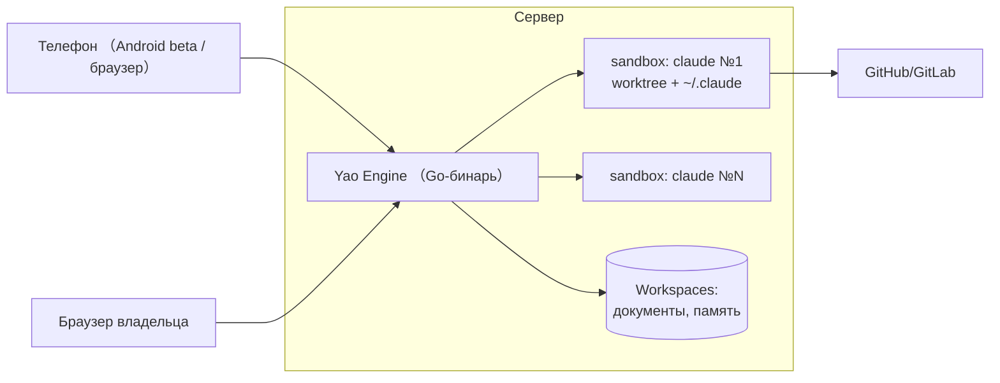
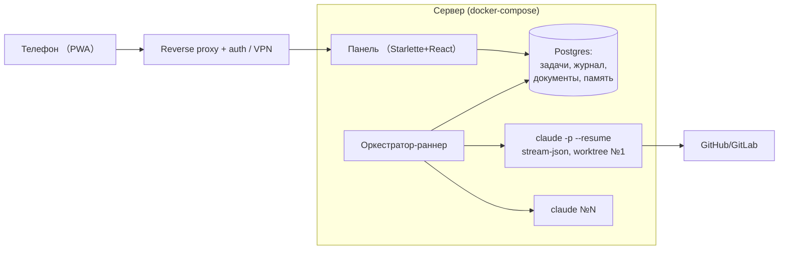

# Design: консолидация оркестрации агентов — альтернативы

- Дата: 2026-08-20
- Фаза: Design (deep-цикл)
- Входы: discovery (`2026-08-20-konsolidaciya-orkestracii-agentov.md`, 2 раунда + уточнения C-Н5/С7), research-дайджест (`...-research.md`)

## 1. Проблема и силы

Нужна единая self-hosted панель управления командой Claude Code-агентов: статусы в реальном времени, подтверждаемая постановка задач (в том числе с телефона), взаимодействие агентов, один источник истины для знаний и памяти (vault Obsidian устраняется, привычки — покрываются, С7), всё на своём сервере (compose, кубер отложен). Жёсткие силы: исполнители остаются на подписке Claude Max 20x без API-токенов (C-Н1); доставка команд должна стать подтверждаемой (F5); один оператор (F7); кандидаты-платформы находятся в rc-стадии (F4); «быстро переехать» (в. 6). Research показал: DSH сегодня не видит и не резюмит Claude Code; yao — видит и резюмит, но, судя по коду, ждёт `ANTHROPIC_API_KEY`; свой оркестратор поверх официального headless-режима технически не заблокирован ничем.

---

## 2. Альтернатива A — yao (Yao Agents) как платформа

**Одной строкой:** принять yao как готовую self-hosted платформу: Claude Code-исполнители в его Docker-песочницах, Mission Control/доска — панель, workspaces — база знаний.

### Эскиз

### Как отвечает силам
- **C1/C2/F5 (наблюдаемость, доставка):** закрывает штатно — stream-json + `--resume`, статусы Mission Control, песочницы персистентны. Лучшее покрытие среди готовых.
- **C-Н1 (подписка):** ⚠ главный риск — код раннера ждёт `ANTHROPIC_API_KEY`; подписочный OAuth не подтверждён. Без положительного спайка альтернатива недопустима.
- **C-Н5/С7 (единая память, привычки Obsidian):** workspaces накапливают документы, но wiki-линки/бэклинки/русский FTS не подтверждены; согласование личных памятей агентов с каноном — строить самим поверх его API.
- **F6/мобильность:** встроенные пользователи/API-ключи, Android beta; «полноценно с телефона» не доказано.
- **F4/F7:** rc каждые 1–3 дня, рефакторинги ядра между rc; но эксплуатация — один Go-бинарь + Docker, посильно одному.
- **Процесс (/ir-task, worktrees, hooks):** тащить внутрь песочниц самим — свои образы поверх `yaoapp/sandbox-claude`.

### Что становится легче
Панель, доска, стриминг, песочницы, мультимодельность (OpenRouter в пресетах), мобильный клиент — не строим ничего из этого.

### Что становится тяжелее
Зависимость от чужого rc-темпа и лицензии (несъёмный брендинг, «логика верификации», право менять условия); наш процесс адаптируется под их модель задач; C7 и «подъём» памяти — всё равно своя разработка, но уже внутри чужой платформы; отладка на стыке «наша обвязка ↔ их песочница».

### Оценка усилий
Спайк — 1–2 дня. При успехе: пилот + перенос задач/знаний + образы песочниц — 2–4 недели. При провале спайка по подписке — альтернатива закрыта (API-токены запрещены C-Н1).

### Где ломается
(а) подписка не заводится в песочнице; (б) rc ломает формат/API чаще, чем успеваем чинить обвязку; (в) лицензия ужесточается; (г) модель задач yao не выражает «готово = мерж + зелёный пайплайн» и наши детекторы расхождений.

---

## 3. Альтернатива B — собственный тонкий оркестратор (эволюция agent-dashboard)

**Одной строкой:** дожать agent-dashboard до полноценного control plane: headless Claude Code (`claude -p --resume`, stream-json) как управляемые исполнители, подтверждаемая доставка, доска задач, канонический стор знаний/памяти в Postgres, всё на сервере в compose.

### Эскиз

### Как отвечает силам
- **C-Н1:** ✅ лучший из всех — headless CLI наследует подписочный OAuth (то же использование, что сегодня, просто на сервере); вспомогательные LLM-нужды — OpenRouter free при желании.
- **C1/C2/F5:** stream-json даёт каждый tool-call и сообщение → статусы честные, «сказал done» проверяется детекторами (они уже есть); доставка становится подтверждаемой: раннер владеет процессом (spawn/resume), а не стучится в чужой сокет. Это прямое лечение болей №2.
- **C-Н5/С7:** documents+revisions+русский FTS уже в базе; достроить wiki-линки/бэклинки/редактор — обозримо; «подъём» личных памятей — хуки Claude Code → API базы.
- **F6/мобильность:** auth и PWA строим сами (reverse proxy + нормальный логин, либо VPN); полный контроль периметра.
- **F4/F7:** ноль внешних rc-зависимостей; но весь bus-factor и качество UI — на нас (сегодняшние AD-16…18 показывают цену спешки).
- **Процесс:** сохраняется как есть — hooks, worktrees, `/ir-task` не трогаем; идеи DSH (append-only лог сессий, состояния доставки) уже частично совпадают со схемой.

### Что становится легче
Никаких компромиссов с чужой моделью задач; переезд инкрементальный (панель уже живая, боли чинятся по одной); полная совместимость с правилами (авторство, «готово = мерж»).

### Что становится тяжелее
Строим сами: доска-UI, стриминговый просмотр сессий, auth, PWA, wiki-слой, синк памяти. Каждая фича конкурирует за время с рабочими проектами. Риск «вечного полуфабриката» — сегодняшний agent-dashboard тому свидетель.

### Оценка усилий
Первый серверный контур (compose + auth + доставка через spawn/resume + доска) — 2–3 недели инкрементально. Полное покрытие С7 + синк памяти — ещё 2–4 недели. Vault выводится по мере готовности документного слоя.

### Где ломается
(а) один оператор перестаёт успевать за хотелками — функциональный разрыв с платформами растёт; (б) если Anthropic ужесточит подписочный headless на серверах — общий риск с A, но здесь хотя бы нет посредника; (в) захочется песочниц/VNC/мультимодельных агентов — начнём переизобретать yao.

---

## 4. Альтернатива C — DSH как платформа (отложенная ставка)

**Одной строкой:** дождаться зрелости DSH (stable, durable-интеграция Claude Code, auth) и строить панель на нём; до тех пор — минимальные заплатки текущего стека.

### Эскиз
Сейчас: статус-кво + точечные фиксы. Позже: DSH-сервер, координатор на OpenRouter-модели, Claude Code-исполнители через повзрослевшие Profile Bundles, панель — DSH Web UI + плагины.

### Как отвечает силам
- **C1/C2/F5:** сегодня — никак (one-shot, невидимость, авто-deny); ставка на то, что ядро дорастёт (интеграция Claude Code уже въезжает в rc.7/rc.8).
- **C-Н1:** ✅ совместим (OAuth наследуется, координатор — OpenRouter free).
- **C-Н5/С7:** session store есть, документного/wiki-слоя нет — строить плагином.
- **F6:** auth отсутствует по дизайну, remote запрещён — ждать или городить туннели.
- **F4:** сейчас худшая; горизонт зрелости неизвестен (роадмапа нет).
- **«Быстро»:** прямо противоречит — сроки вне нашего контроля.

### Что легче / тяжелее
Легче: платформа с самой богатой моделью расширения (всё — плагин), огромная экосистема, наши знания DSH уже собраны. Тяжелее: ждать неизвестно сколько; боли живут всё это время; плагины отваливаются между rc.

### Оценка усилий
Сейчас ~0 (наблюдение + заплатки). При наступлении зрелости — 3–6 недель на платформу и плагины. Срок наступления — не наш.

### Где ломается
Если durable claude-code-провайдер и auth не появятся в обозримые месяцы — это не альтернатива, а отказ от решения.

---

## 5. Альтернатива D — статус-кво (ничего не менять)

**Одной строкой:** оставить vault + agent-dashboard + 7 терминалов, чинить только критические дефекты (AD-16…18).

- **Как отвечает силам:** C-Н1 ✅; всё остальное ❌ — боли №2 (статусы, доставка, дублирование, нет доски, привязка к Obsidian) сохраняются; C-Н5 недостижим (три хранилища); мобильности нет.
- **Легче:** ноль затрат, ноль рисков миграции. **Тяжелее:** всё, ради чего затевался цикл, не происходит; расхождения продолжают стоить времени (AD-7, AD-14 — свежие примеры).
- **Усилия:** ~0. **Где ломается:** уже сломано — владелец инициировал цикл именно из этой точки.

---

## 6. Матрица сравнения

| Сила | A: yao | B: свой оркестратор | C: DSH позже | D: статус-кво |
|---|---|---|---|---|
| C-Н1: только подписка Max | **неизвестно** (спайк!) | **good** | good | good |
| C1/C2/F5: наблюдаемость + подтверждаемая доставка | **good** (если спайк пройдёт) | good (строить, примитивы готовы) | poor (сегодня) | poor |
| C-Н5/С7: единая память + привычки Obsidian | fair (строить поверх) | fair (строить у себя, FTS/ревизии есть) | poor | poor |
| F6: сервер + полноценный мобильный доступ | fair (Android beta, auth есть) | fair (auth/PWA строить) | poor (auth нет by design) | poor |
| F4/F7: зрелость / один оператор | poor (rc 1–3 дня, лицензия) | good (свой темп; свой bus-factor) | poor (срок чужой) | good |
| «Быстро переехать» | good/poor (бинарно от спайка) | fair (2–3 недели до контура) | poor | N/A |

## 7. Что сознательно НЕ рассматривали

- **Kubernetes сейчас** — решено владельцем (П-1): compose, кубер при появлении причины.
- **Миграция исполнителей на DSH/DeepSeek-модели** — закрыто ответом №1: Claude Code и подписка остаются.
- **Оркестрация через Agent SDK или Managed Agents** — только `ANTHROPIC_API_KEY`, прямое нарушение C-Н1; Managed Agents вдобавок уводит данные в чужой sandbox.
- **SaaS-оркестраторы агентов** — координация и код уходят третьей стороне; конфликтует с правилом авторства и приватностью контура.
- **dsh-crew и подобные** — обратное направление (Claude Code управляет DSH-воркерами), не наша задача.
- **DSH `agent-team` как ростер для Claude Code** — технически невозможно: членство требует `prepareContinuable`, у продуктовых провайдеров его нет (проверено по исходникам).
- **AFFiNE как канонический стор** — выведен из скоупа владельцем (ответ №5); останется потребителем, если вообще останется.

## 8. Что нужно узнать, чтобы решить

1. **Спайк S1 (ворота для A):** заводится ли Claude Code в yao-песочнице от подписочного OAuth (`~/.claude` монтированием), без `ANTHROPIC_API_KEY`. 1–2 дня.
2. **Спайк S2 (общий для A и B):** несколько параллельных headless-сессий под Max 20x на одной машине — фактическое поведение лимитов.
3. **Проверка C7 в yao:** есть ли wiki-линки/бэклинки/русский поиск в его документах, и есть ли API доски (для наших детекторов расхождений).
4. **Инвентаризация обвязки:** что именно из `~/.claude` (hooks, skills, MCP, память) обязано жить рядом с исполнителем — цена контейнеризации одинаково нужна для A и B.
5. **EverOS:** умеет ли быть каноном для Claude Code-агентов (или это только DSH/свой формат) — влияет на слой памяти в A и B.

→ Следующая фаза: `/architect:decide` после спайков S1–S2 (или сразу, если владелец готов решать с текущей неопределённостью — тогда решение обязано включать план Б на случай провала спайка).
