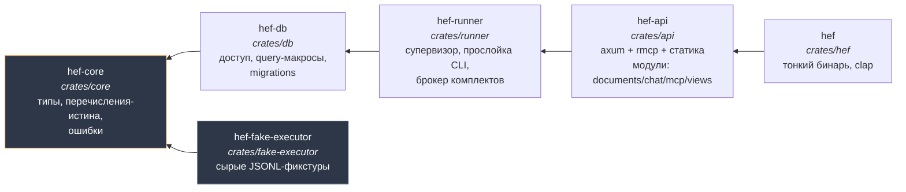
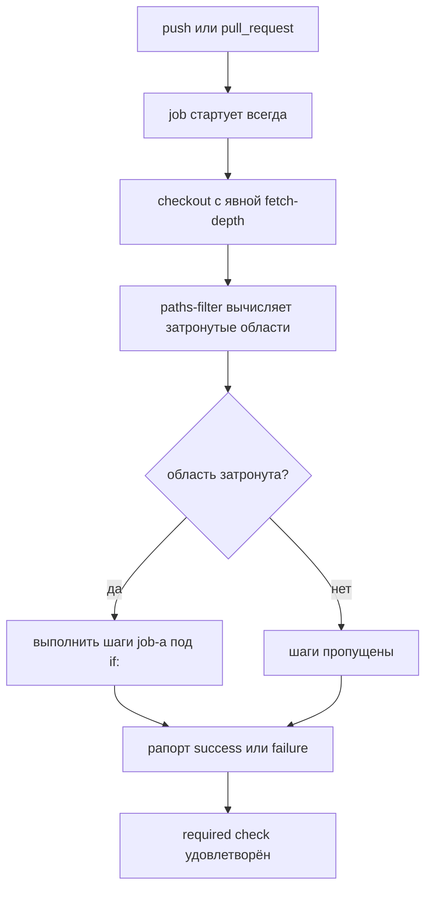

# feat: скелет монорепы Гефеста — workspace, шесть крейтов, mise, CI (GF-5 / PR-1)

## Summary

Первый Rust-код репозитория: виртуальный cargo workspace с шестью крейтами по ADR-0014, `mise.toml` как единственный раннер задач, пин тулчейна, первый workflow GitHub Actions с фильтрацией внутри job-ов и гигиена репозитория. Бизнес-логики, миграций и dev-контура нет — это PR-1 из трёх по фазировке ADR-0014 §5.

Скелет — не формальность: пути из него врастают в CI-фильтры, `.sqlx`-метаданные, Docker-контексты и инструкции агентам. Ошибка в раскладке позже стоит переименования всего, поэтому граница «что в PR-1, а что в PR-2/PR-3» соблюдается буквально.

---

## Problem Frame

Репозиторий `gefest` содержит только документацию: пятнадцать принятых ADR, задачи GF-N, исследовательскую базу. Кода нет ни строки — нет `Cargo.toml`, нет `.github/`. ADR-0014 (deep-цикл D-17: два раунда discovery, research по шести темам, roast пятью ролями — 37 находок, 8 high, meta-review) зафиксировал раскладку и фазировку, но не выполнил её.

Пока скелета нет, заблокированы обе ветки работы: GF-5 (миграции v1-ядра — некуда класть `crates/db`) и GF-2 (раннер-супервизор — некуда класть `crates/runner`). Скелет разблокирует обе.

**Дополнительная сложность — bootstrap ворот.** ADR-0012 требует, чтобы код попадал в `main` только через PR с зелёным CI. Но CI в этом PR только появляется: GitHub не даёт назначить required check, который ни разу не прогонялся. Ворота включаются в два приёма, и это заложено в план, а не обнаруживается по факту.

---

## Requirements

Источник — ADR-0014 (§ Decision, §5 фазировки) и задача `docs/tasks/GF-5-migracii-v1-yadra.md`.

| ID | Требование |
|---|---|
| R1 | Виртуальный cargo workspace в корне: `members` — шесть крейтов, `[workspace.package]` с `edition = "2024"`, `[workspace.dependencies]`, `[workspace.lints]` |
| R2 | Шесть крейтов в каталогах `crates/{core,db,runner,api,hef,fake-executor}` с графом зависимостей `hef→api→runner→db→core` и `fake-executor→core` |
| R3 | `crates/core` имеет чистый дефолтный граф: без tokio, axum и sqlx; sqlx подключается только через optional feature, которую включает `crates/db` |
| R4 | `mise.toml` с пинами инструментов и задачами сборки, линта, тестов и sqlx-цикла; `justfile` не заводится |
| R5 | Пин тулчейна Rust, согласованный с пином в `mise.toml` |
| R6 | Один workflow GitHub Actions с job-ами `rust`, `front`, `migrations`, `contract`, `infra`; docker-job отсутствует |
| R7 | Фильтрация по путям выполняется внутри job-а: job стартует всегда и решает по diff, чтобы отфильтрованный required check не блокировал мерж навсегда |
| R8 | Область срабатывания rust-job — `crates/**` плюс корневые `Cargo.toml`/`Cargo.lock` плюс `.sqlx/**` плюс файлы, управляющие самой сборкой: `mise.toml`, `rust-toolchain.toml`, `scripts/**`, `.github/workflows/**` |
| R9 | Все экшены GitHub Actions закреплены полным SHA коммита с комментарием-версией |
| R10 | `.gitignore` включает `.env*`, `target/` и группу ключей (`*.pem`, `*.key`, `*.p12`, `*.age`, `secrets/`); `Cargo.lock` коммитится |
| R11 | `.dockerignore` покрывает `.git/`, `.env*`, `reference/`, `docs/`, ключи |
| R12 | `crates/db/README.md` содержит runbook красного `sqlx prepare --check` и интерим-регламент «SQL-запросы меняет владелец» |
| R13 | Работа идёт в отдельной ветке и попадает в `main` через PR; прямой пуш кода в `main` запрещён |
| R14 | Ни в одном артефакте (код, коммиты, описание PR) нет упоминаний ИИ, ассистента и соавторства; автор — Igor Kramar |

R1–R12 закрываются юнитами и перечислены в их полях «Requirements». **R13 и R14 — процессные**: они выполняются способом ведения работы, а не файлом, который можно создать, поэтому ни за одним юнитом не закреплены и проверяются в Definition of Done. Отсутствие их в юнитах — не пробел покрытия.

---

## Key Technical Decisions

### KTD1. Имена пакетов — `hef-*`, каталоги — по ADR-0014

Каталоги остаются каноническими (`crates/core`, `crates/db`, …), имена пакетов получают префикс: `hef-core`, `hef-db`, `hef-runner`, `hef-api`, `hef-fake-executor`; бинарный пакет — `hef` (совпадает с именем CLI).

**Причина — проверено эмпирически, не выведено по памяти.** Пакет с именем `core` затеняет стандартный `core` во всех зависимых крейтах: в крейте, зависящем от локального `core`, обращение `core::mem::swap` падает с `E0433: failed to resolve`. Компилятор предлагает `use std::mem`, то есть ошибка выглядит как ошибка кода, а не как коллизия имён — диагностировать её через полгода дороже, чем избежать сейчас. Ловушка сработает на любом заимствованном фрагменте, использующем `core::`.

ADR-0014 фиксирует **пути каталогов**, а не имена пакетов, поэтому решение уточняет ADR, а не противоречит ему. В коде обращение выглядит как `hef_core::…`.

### KTD2. `resolver = "3"` объявляется явно

Для виртуального workspace (корень без `[package]`) resolver **не выводится** из edition: выводить не из чего — у корня нет `package.edition`. Документация Cargo требует явного значения именно для этого случая. Пропуск даёт молчаливый откат на resolver 1 со сломанной изоляцией фич.

### KTD3. Фичи sqlx — `tls-rustls-ring-webpki` вместо `tls-rustls` *(расхождение с ADR-0014, требует подтверждения владельца)*

ADR-0014 перечисляет фичи sqlx как `runtime-tokio`, `tls-rustls`, `postgres`, `uuid`, `time`, `migrate`, `json`. В sqlx 0.9 (опубликована 2026-05-06) оси runtime и TLS разделены, а TLS дополнительно расщеплена по crypto-провайдеру и источнику корневых сертификатов. Голая `tls-rustls` компилируется, но не даёт пригодного бэкенда для реального подключения к Postgres.

Рабочий состав: `runtime-tokio`, **`tls-rustls-ring-webpki`**, `postgres`, `uuid`, `time`, `migrate`, `json`, **`macros`**, **`derive`**. Вариант `-webpki` выбран как переносимый (встроенный набор корневых сертификатов, без зависимости от OpenSSL хоста) — это соответствует однобинарной поставке.

`derive` добавлен по решению владельца заодно с `macros`: он даёт `FromRow`, который понадобится прослойке доступа следующего PR. Логика та же, что у правила H-4 — корневой манифест горячий, и открывать его второй раз ради одной фичи дороже, чем перечислить состав один раз сейчас.

**`macros` — второе расхождение с ADR, и без него ломается вся последующая работа.** Проверено на sqlx 0.9 с точным списком ADR и `default-features = false`: резолвится набор `_rt-tokio, json, migrate, postgres, runtime-tokio, sqlx-postgres, time, tls-rustls-ring-webpki, uuid` — `macros` отсутствует, крейт `sqlx-macros` не собирается вовсе. Именно фича `macros` даёт `sqlx::query!` и `sqlx::migrate!`. Без неё не компилируется ни один запрос следующего PR GF-5, а весь runbook U6 и сторож `prepare --check` теряют предмет: проверять синхронность `.sqlx` не с чем.

Причина ловушки в том, что `default-features = false` — требование самого ADR (ловушка наследования фич) — снимает и те дефолтные фичи sqlx, которые нужны. Отключение дефолтов обязано сопровождаться полным перечислением нужного, иначе оно тихо вычитает необходимое.

Оба расхождения (имя TLS-фичи и добавленный `macros`) фиксируются здесь и выносятся в описание PR: решение ADR — sqlx с rustls, без native-tls — остаётся в силе, уточняется состав под реальность 0.9.

### KTD4. Контракт зависимостей объявляется в PR-1; ни один крейт его не активирует

ADR-0014 принял правило H-4: зависимости в горячий корневой `Cargo.toml` добавляет владелец отдельным PR, первым в очереди. PR-1 объявляет контракт версий и фич для `sqlx` и `tokio` (с `default-features = false`); `hef-core` объявляет `sqlx` как **optional**, чего требует R3, но фичу не включает никто.

**Что при этом происходит на самом деле — проверено локально, а не выведено из общих соображений:**

| | Результат |
|---|---|
| `tokio`, объявленный в workspace, но не упомянутый ни одним крейтом | в `Cargo.lock` **не попадает** |
| `sqlx`, объявленный в `hef-core` как `optional = true` при выключенной фиче | в `Cargo.lock` **попадает** (в пробе — 133 пакета вместе с транзитивными) |
| он же при `cargo build --workspace` | **не компилируется** — собираются только собственные крейты, ноль артефактов sqlx/tokio |

Разница принципиальна и легко путается: `Cargo.lock` фиксирует **резолюцию**, а не сборку. Опциональная зависимость резолвится всегда — она обязана иметь зафиксированную версию на случай включения фичи. Ожидание «в lock не будет sqlx» было бы неверным, и юнит, проверяющий это, гарантированно красный.

Что действительно проверяется в PR-1: `tokio` отсутствует в lock как прямая зависимость, а `cargo build --workspace` не собирает ни одного стороннего крейта.

### KTD5. Пин Rust дублируется в `mise.toml` и `rust-toolchain.toml`, дрейф ловится сторожем

ADR-0014 §5 требует оба файла. Они не конфликтуют, но и не эквивалентны: mise ставит Rust через rustup и экспортирует `RUSTUP_TOOLCHAIN`, который в порядке приоритетов rustup стоит **выше** файла `rust-toolchain.toml`. Внутри `mise run` побеждает пин mise; вне его — редактор, rust-analyzer, голый `cargo` — читается `rust-toolchain.toml`.

Опасность не в конфликте, а в тихом расхождении версий между CI и рабочим местом. Лечение дешёвое: оба файла держатся с одинаковой версией, а равенство проверяется сторожем (`mise run guard:toolchain-pin`), у которого честный путь прохождения есть у всех классов участников — он не требует ни сети, ни БД.

### KTD6. Тулчейн в CI ставит mise; отдельный экшен установки Rust не используется

Первая редакция плана брала `actions-rust-lang/setup-rust-toolchain`. Это ошибка, вскрытая собственным KTD5: раз содержательные шаги идут через `mise run` (R4), а mise экспортирует `RUSTUP_TOOLCHAIN` приоритетнее файла, то отдельный экшен установил бы тулчейн, **которым ничего не собирается** — job тратит время на вторую установку, а читатель workflow получает неверную модель того, чем собран код.

Владелец тулчейна в CI один — `jdx/mise-action`, тот же механизм, что и локально. `rust-toolchain.toml` остаётся для всего, что мимо mise: редактор, rust-analyzer, голый `cargo`; равенство версий держит `guard:toolchain-pin`.

Сравнение экшенов сохранено, потому что оно объясняет, почему возврат к ним нежелателен: `dtolnay/rust-toolchain` распространяется **ветками** (`stable`, `nightly`), которые сопровождающий двигает при каждом релизе Rust — SHA-пин такой ветки противоречит самой цели экшена: версия Rust замерзает на дате пина, а ничто в workflow не подсказывает, что пора обновляться. `actions-rust-lang/setup-rust-toolchain` версионируется нормально и был бы правильным выбором, **если** бы тулчейн в CI ставил не mise.

**Следствие для проверки — снято по факту.** Было опасение, что компоненты `rustfmt` и `clippy`, объявленные в `rust-toolchain.toml`, не доедут при установке через `RUSTUP_TOOLCHAIN`. Проверено на первом прогоне: `mise exec -- rustc --version` даёт 1.98.0, `cargo clippy --version` и `cargo fmt --version` отрабатывают. Отдельный шаг установки компонентов не нужен; сценарий в U3 остаётся как регрессионная проверка.

### KTD7. `sqlx prepare --check` в CI PR-1 не заводится *(применение learning-а проекта)*

`docs/solutions/best-practices/storozh-protiv-nevozmozhnosti.md` даёт правило: сторож легитимен только тогда, когда у каждого класса участников есть честный путь до зелёного внутри их периметра.

В PR-1 сторожить нечего: нет ни одного макроса `query!`, нет каталога `.sqlx`, нет миграций. При этом `prepare --check` требует живого мигрированного Postgres и `DATABASE_URL` — ресурса, которого нет ни в контейнере задачи агента (ADR-0006: без docker и секретов БД), ни в job-е CI до появления service-контейнера.

Поэтому: **runbook пишется** (R12, требование ADR-0014 §5), задача `mise run sqlx:check` **объявляется**, а CI-шаг с ней **не включается**. Он приходит вместе с первыми `query!` в следующем PR GF-5 — одним изменением с service-контейнером Postgres и dev-БД из комплекта брокера.

**Но отложенный сторож не должен держаться на памяти.** ADR-0014 противопоставлял сторожей ровно этому: они ловят дрейф машинно. Между PR-1 и PR с service-контейнером первый `query!` может приехать без `prepare --check`, и рассинхрон `.sqlx` станет возможен молча — в фазе, где изменения SQL названы основным потоком. Сам learning этого не оправдывает: он запрещает сторож без честного пути, а не сторож вообще.

Поэтому в PR-1 ставится **офлайн-растяжка** `guard:sqlx-step` (U4): если в `crates/**` встречается `query!`, `query_as!` или `query_file!`, а в `.github/workflows/ci.yml` нет шага `prepare --check` — выход ненулевой. Ресурсов она не требует, честный путь есть у всех классов. В PR-1 она зелёная (макросов нет), а первый же `query!` без сторожа валит CI — вместо того чтобы полагаться на комментарий в `ci.yml`.

### KTD8. Сторож чистоты графа `hef-core` заводится сразу

Противоположный случай к KTD7: проверка выполняется офлайн одним `cargo tree`, ресурсов не требует, честный путь есть у всех классов. Ставится в PR-1, пока граф пуст — так он ловит первое же нарушение, а не констатирует уже случившийся дрейф.

**Механика — белый список, а не чёрный.** Первая редакция плана предлагала перебирать запрещённые пакеты через `cargo tree -i` и считать ненулевой код успехом, добавив различение «нет зависимости» и «cargo отказал» по тексту ошибки. При реализации выяснилось, что различить их нельзя: cargo выдаёт **идентичное** сообщение `did not match any packages` и когда зависимости нет в графе, и когда пакета не существует вовсе. Проверено прогоном `-i tokio` против `-i tokyo` — один и тот же вывод, один и тот же код 101. Сторож с чёрным списком уходит в вечно-зелёный от одной описки, и именно его, поставленного на пустом графе, никто не перепроверит.

Поэтому сторож сравнивает **фактический состав графа с ожидаемым**: `cargo tree -p hef-core -e normal --no-default-features --prefix none` обязан вернуть только пакеты из списка `ALLOWED` (сейчас — единственный `hef-core`). Опечатка в `ALLOWED` делает сторожа красным, а не зелёным: ошибка проявляется, а не прячется. Появление законной зависимости требует явно расширить список — расширение границы видно в диффе. Побочная выгода, которой у чёрного списка нет: ловятся и транзитивные пакеты (в проверке всплыла `pin-project-lite`, пришедшая с `tokio`).

### KTD9. Required checks включаются вторым приёмом, после первого зелёного прогона

GitHub не показывает в списке required checks те, что ни разу не завершались успешно за последние семь дней. Попытка включить ворота тем же PR, что заводит workflow, приводит к тому, что имена job-ов просто не находятся в интерфейсе.

Последовательность: PR-1 мержится с работающим, но ещё не обязательным CI → после зелёного прогона владелец включает ruleset на `main`. Правила репозитория (rulesets) предпочтительнее классической защиты веток: они видимы всем, накладываются слоями и развиваются GitHub-ом.

**Состав ruleset-а — четыре правила, не одно.** Только required checks оставили бы R13 декларацией: статусы требуются на PR, а прямой пуш, force-push и удаление ветки остаются открытыми. Момент включения — единственная дешёвая точка завести всё сразу; потом никто не вернётся, потому что ворота уже «выглядят включёнными».

1. Require a pull request before merging;
2. Пять required status checks — `rust`, `front`, `migrations`, `contract`, `infra`;
3. Block force pushes;
4. Restrict deletions.

**Bypass list пустой — ruleset действует и на владельца** (решение владельца). Исключение для себя обесценило бы ворота: путь в `main` мимо PR существовал бы, просто им пользовался бы один человек. Практическое следствие принимается сознательно: правки документации владелец тоже проводит через PR, хотя ADR-0012 разрешает ему прямой пуш доков — разделять режимы на уровне ruleset-а сложнее, чем открыть PR.

### KTD10. Фильтрация — `dorny/paths-filter` первым шагом плюс `if:` на последующих шагах

Job стартует всегда, первым шагом вычисляет затронутые области, остальные шаги выполняются под условием. Job рапортует `success` даже когда работы не было — required check удовлетворён.

Экшен проверен на живость: v4.0.3 от 2026-08-05, миграция на Node 24 выполнена.

**Оговорка о базе сравнения — ровно обратная той, что напрашивается.** На событии `pull_request` экшен git не использует вовсе: он спрашивает список файлов у REST API, поэтому история и глубина клона там не нужны, а нужно право `pull-requests: read`. История нужна на событии `push`, где сравнение идёт по git — там checkout берёт `fetch-depth: 0`. Отсутствие общего предка экшен трактует как «изменено всё», то есть ошибается в безопасную сторону.

### Решения, принятые ранее и не пересматриваемые

Перечислены как контекст реализации; каждое прошло deep-цикл D-17 и закреплено в ADR-0014.

- Шестёрка крейтов *(session-settled: user-approved — выбрана вместо компактной тройки и мелкозернистой раскладки 8+: границы видны агенту из имени крейта, инкрементальная сборка лучше тройки, без каскадов пересборок)*. Governs R2.
- mise как раннер задач *(session-settled: user-directed — выбран вместо justfile: ноль новых инструментов, параллельный dev-режим; два раннера одновременно дают дрейф)*. Governs R4.
- Экшены по SHA *(session-settled: user-approved — вместо закрепления по тегам: CVE-2025-30066)*. Governs R9.
- Фильтрация внутри job-а *(session-settled: user-approved — вместо `on: paths:`: отфильтрованный на уровне workflow job не рапортует и блокирует мерж навсегда)*. Governs R7.
- Область rust-job шире `crates/**` *(session-settled: user-approved, закрытие находки roast B-2 — правка корневого манифеста или `.sqlx` иначе не гоняла бы сборку)*. Governs R8.
- `default-features = false` в workspace-зависимостях *(session-settled: user-approved — вместо наследования дефолтных фич: ловушка наследования)*. Governs R1.
- sqlx в `core` только optional feature *(session-settled: user-approved — вместо обычной зависимости: `core` держит типы и чистые переходы машин состояний)*. Governs R3.
- PR-1 без docker-job *(session-settled: user-approved, фазировка CC-8 — вместо одного большого PR: PR-3 везёт Dockerfile+GHCR отдельно)*. Governs R6.
- `.env*` в `.gitignore`, `Cargo.lock` в git *(session-settled: user-approved — граница C-2: в `.env` только локальный dev-DSN)*. Governs R10.
- `cargo deny` не заводится *(session-settled: user-approved, запись C-5 — отложено до причины распространения)*.
- Ветка и PR обязательны *(session-settled: user-directed, ADR-0012 — вместо коммита в `main`)*. Governs R13.
- Авторство без упоминаний ИИ *(session-settled: user-directed — вместо трейлеров соавторства)*. Governs R14.

---

## High-Level Technical Design

Граф зависимостей крейтов — канон «куда класть код». Стрелка означает «зависит от».



`hef-core` выделен: его дефолтный граф обязан оставаться чистым (R3), это сторожится машинно (KTD8). Единственный крейт, включающий фичу `sqlx` у `hef-core`, — `hef-db`.

Поток проверки в CI: job стартует безусловно, решает по diff, рапортует в любом случае.



Ключ конструкции — узел «job стартует всегда»: именно его отсутствие при `on: paths:` оставляет PR навсегда в состоянии ожидания статуса.

---

## Output Structure

```
gefest/
├── Cargo.toml                    # виртуальный workspace, resolver 3
├── Cargo.lock                    # коммитится
├── rust-toolchain.toml           # пин, согласован с mise.toml
├── mise.toml                     # пины инструментов + задачи
├── .gitignore                    # target/, .env*
├── .dockerignore                 # .git/, .env*, reference/, docs/, ключи
├── .github/
│   └── workflows/
│       └── ci.yml                # rust, front, migrations, contract, infra
├── crates/
│   ├── core/                     # пакет hef-core
│   │   ├── Cargo.toml
│   │   └── src/lib.rs
│   ├── db/                       # пакет hef-db
│   │   ├── Cargo.toml
│   │   ├── README.md             # runbook prepare --check + интерим-регламент
│   │   └── src/lib.rs
│   ├── runner/                   # пакет hef-runner
│   ├── api/                      # пакет hef-api
│   ├── hef/                      # пакет hef, бинарь
│   │   └── src/main.rs
│   └── fake-executor/            # пакет hef-fake-executor
├── scripts/
│   ├── guard-core-graph.sh       # сторож чистоты дефолтного графа
│   └── guard-sqlx-step.sh        # растяжка: query! без CI-шага prepare --check
└── ARCHITECTURE.md               # правится в U7: каталог → имя пакета
```

Каталоги `web/`, `infra/`, `tests/contract/` в PR-1 **не создаются**: пустые каталоги git не хранит, а заводить в них заглушки ради срабатывания CI-фильтров — способ получить мусор, который потом никто не решится удалить. Соответствующие job-ы стартуют, не находят изменений и рапортуют успех.

---

## Implementation Units

### U1. Корень workspace и гигиена репозитория

**Goal.** Виртуальный workspace собирается пустым, дерево игнорирует лишнее.

**Requirements.** R1, R10, R11; KTD2, KTD3, KTD4.

**Dependencies.** Нет.

**Files.**
- `Cargo.toml` (создать)
- `.gitignore` (изменить — сейчас содержит только `reference/`)
- `.dockerignore` (создать)

**Approach.**
1. `[workspace]` с `members` на шесть путей и **явным** `resolver = "3"` (KTD2).
2. `[workspace.package]`: `edition = "2024"`, `version = "0.1.0"`, `license`, `repository`.
3. `[workspace.dependencies]`: `tokio` и `sqlx` с `default-features = false` и составом фич по KTD3; ни один крейт их пока не подключает (KTD4).
4. `[workspace.lints.rust]` с ключом `unsafe_code = "forbid"` и `[workspace.lints.clippy]` с ключом `all = "warn"`. Внутри таблицы `clippy` префикс `clippy::` **не пишется** — имя таблицы уже задаёт инструмент. Ключ `clippy::all` делает манифест невалидным, и падает не линт, а любая команда cargo в workspace. Расширять ли набор до `clippy::pedantic` — открытый вопрос 2; пока он не решён, реализуется минимум.
5. `.gitignore` дополняется `target/`, `.env*`, группой ключей (`*.pem`, `*.key`, `*.p12`, `*.age`, `secrets/`) и `.sqlx/tmp*`; строка `reference/` сохраняется. Группа ключей стоит здесь, а не только в `.dockerignore`: git — необратимый канал (коммит уходит на remote и остаётся в истории), а `.dockerignore` в PR-1 вообще инертен — Dockerfile приезжает лишь в PR-3.
6. `.dockerignore` по составу R11.

**Patterns to follow.** Раскладка и состав — `ARCHITECTURE.md`, раздел «Структура (C4, container)»; он же канон, на который ссылаются инструкции агентам.

**Test scenarios.**
- `members` перечисляет шесть путей сразу, но крейтов ещё нет — поэтому cargo-команды в этом юните **не проверяются**: они закономерно падают на отсутствующих членах и становятся зелёными в U2. Проверка U1 ограничена содержимым файлов.
- `.gitignore` покрывает `target/`, `.env` и представительный ключ — `git check-ignore -v 'target/' .env secrets/x.key` возвращает сработавшее правило для каждого; шаблон `.env*` обязан ловить и файл без суффикса.
  Слеш в `'target/'` обязателен: правило с завершающим слешем матчит только каталоги, а каталога в этом юните ещё нет — `git check-ignore -v target` вернул бы код 1 на **корректном** `.gitignore` и отправил реализатора править верное правило.
- Строка `reference/` в `.gitignore` сохранена — существующее правило не затёрто.
- `.dockerignore` содержит все пять групп R11; проверяется вычиткой.

**Verification.** Корневой манифест содержит явный `resolver = "3"`, оба ignore-файла на месте, существующие правила не потеряны. Сборка проверяется в U2.

---

### U2. Шесть крейтов, граф зависимостей, чистый `hef-core`

**Goal.** Шесть пакетов существуют, зависят друг от друга строго по графу ADR-0014, `hef-core` чист по умолчанию.

**Requirements.** R2, R3; KTD1.

**Dependencies.** U1.

**Files.**
- `crates/core/Cargo.toml`, `crates/core/src/lib.rs` (создать)
- `crates/db/Cargo.toml`, `crates/db/src/lib.rs` (создать)
- `crates/runner/Cargo.toml`, `crates/runner/src/lib.rs` (создать)
- `crates/api/Cargo.toml`, `crates/api/src/lib.rs` (создать)
- `crates/hef/Cargo.toml`, `crates/hef/src/main.rs` (создать)
- `crates/fake-executor/Cargo.toml`, `crates/fake-executor/src/lib.rs` (создать)

**Approach.**
1. Имена пакетов — `hef-core`, `hef-db`, `hef-runner`, `hef-api`, `hef`, `hef-fake-executor` (KTD1); каталоги строго по ADR.
2. Каждый `Cargo.toml` наследует `edition.workspace = true`, `version.workspace = true`, `[lints] workspace = true`.
3. Зависимости ровно по графу: `hef→hef-api→hef-runner→hef-db→hef-core`, `hef-fake-executor→hef-core`. Лишние рёбра не заводятся — граф и есть архитектурная граница.
4. `hef-core`: `[features] default = []`, `sqlx = ["dep:sqlx"]`, зависимость `sqlx = { workspace = true, optional = true }`. Пустой `default` объявляется **явно**, иначе чужое `default-features = true` протащит фичи.
5. `hef-db` зависит от `hef-core` **без включения фичи**: `hef-core = { path = "../core" }`. Фича `sqlx` объявлена, но в PR-1 её не включает никто — иначе `dep:sqlx` активируется, sqlx резолвится и попадает в `Cargo.lock`, что прямо противоречит KTD4 и правилу H-4 «зависимости добавляет владелец отдельным PR». Строка `features = ["sqlx"]` приходит тем же PR, что и первый реальный код доступа к БД.
6. `crates/hef/src/main.rs` — бинарь, печатающий имя и версию; подкоманды clap приходят с первой реальной командой.
7. Каждый `lib.rs` открывается `//!`-документацией, называющей **границу крейта** одним абзацем — что сюда класть и что не класть. Это не украшение: инструкции агентам ссылаются на границы, и первое место, куда смотрит читатель кода, — начало `lib.rs`.

**Test scenarios.**
- `cargo metadata --format-version 1` перечисляет ровно шесть членов workspace — отложенная из U1 проверка корневого манифеста.
- `Cargo.lock` создаётся и **не** содержит `tokio` как прямую зависимость. Наличие в нём `sqlx` с транзитивным деревом — **ожидаемо и не является ошибкой** (KTD4): опциональная зависимость резолвится всегда.
- `cargo build --workspace --locked` не собирает ни одного стороннего крейта — в `target/debug/deps` нет артефактов sqlx и tokio. Это и есть настоящая проверка «фича не активирована»; ожидание пустого `Cargo.lock` было бы неверным.
- `git status --short` после сборки не показывает `target/` — `.gitignore` из U1 работает на реальном дереве.
- `cargo build --workspace --locked` собирает все шесть пакетов.
- `cargo tree -p hef-core -e normal --no-default-features` не содержит `tokio`, `axum`, `sqlx` — прямая проверка R3.
- `cargo tree -p hef-db -e normal` содержит `hef-core` — ребро графа на месте.
- Манифест `crates/core/Cargo.toml` содержит `[features] default = []` и `sqlx = ["dep:sqlx"]` — фича объявлена. Активировать её в PR-1 нечем и незачем: любая команда с `--features sqlx` резолвит зависимость и добавит её в `Cargo.lock`, сломав соседнюю проверку. Работоспособность фичи проверяет тот PR, который первым её включит.
- `cargo tree -p hef-core -e normal -i hef-db` завершается ненулевым кодом — обратных рёбер нет, граф ацикличен по построению.
- Один smoke-тест в `hef-core` (`assert_eq!` на константе версии или тривиальной функции) — доказывает, что `cargo test --workspace` действительно выполняет тесты, а не проходит вхолостую на нулевом их количестве.

**Verification.** Шесть пакетов собираются, граф соответствует ADR-0014, `cargo test --workspace` зелёный и непустой.

---

### U3. `mise.toml` — пины инструментов и задачи

**Goal.** Единственный раннер задач: одни и те же определения работают локально и в CI.

**Requirements.** R4, R5; KTD5.

**Dependencies.** U2.

**Files.**
- `mise.toml` (создать)
- `rust-toolchain.toml` (создать)

**Approach.**
1. `[tools]`: `rust` с точной версией и `"cargo:sqlx-cli"` с версией под sqlx 0.9 (пин требует ADR-0014 §5). **Состав фич sqlx-cli проверяется по факту установки** — у CLI-крейта имена фич грубее, чем у библиотеки, и совпадения с составом KTD3 ожидать не следует.
2. **CI ставит только `rust`, не весь набор `[tools]`.** Backend `cargo:` — это сборка из исходников: транзитивное дерево sqlx-cli резолвится заново каждый прогон и его `build.rs` исполняются на раннере. Это незакреплённая supply-chain-поверхность шире той, ради которой заведены SHA-пины (R9), и в PR-1 она оплачивается за нулевую пользу: ни один CI-шаг sqlx-cli не вызывает (KTD7). Поэтому `jdx/mise-action` конфигурируется на установку одного инструмента, а пин sqlx-cli остаётся для локальной работы.
3. `rust-toolchain.toml`: `channel` той же версией, `components = ["rustfmt", "clippy"]`, `profile = "minimal"` (KTD5).
4. Задачи: `build`, `test`, `fmt`, `fmt:check`, `lint` (clippy с `-D warnings` **на шаге**, не глобальным `RUSTFLAGS`), `sqlx:prepare`, `sqlx:check`, `guard:core-graph`, `guard:sqlx-step`, `guard:toolchain-pin`, `ci` (композит из проверок, доступных без внешних ресурсов).
5. `sqlx:check` объявляется, но в CI PR-1 не вызывается (KTD7); в описании задачи прямо сказано, что она требует живого Postgres.
6. Пин версии Rust в двух файлах обязан совпадать; равенство проверяет `guard:toolchain-pin`.

**Test scenarios.**
- `mise run build` и `mise run test` отрабатывают на чистом клоне после `mise install`.
- `mise run lint` падает на намеренно внесённом clippy-нарушении и проходит после отката — доказательство, что `-D warnings` действительно включён, а не написан для вида.
- `mise run guard:toolchain-pin` проходит на согласованных файлах и падает при ручном расхождении версии в одном из них.
- `mise tasks` перечисляет все объявленные задачи без ошибок разбора. Композитная задача `ci` при этом **ещё не запускается**: она вызывает `guard:core-graph`, скрипт которого создаётся в U4. Её первый реальный прогон — в U4.
- Версия Rust, которую видит `mise exec -- rustc --version`, совпадает с пином в обоих файлах.
- `mise exec -- cargo clippy --version` и `mise exec -- cargo fmt --version` отрабатывают — компоненты доступны в окружении mise. Сценарий обязателен: `rust-toolchain.toml` объявляет `components`, но при установке через `RUSTUP_TOOLCHAIN` rustup их оттуда не читает (KTD6). Если компонентов нет — они добавляются установочным шагом, а не предполагаются.

**Verification.** Задачи выполняются, пины согласованы, сторож пина ловит искусственно внесённое расхождение.

---

### U4. Два офлайн-сторожа: чистота графа `hef-core` и растяжка под будущий `prepare --check`

**Goal.** Нарушение границы `core` ловится машинно с первого дня; отложенный sqlx-сторож не забывается.

**Requirements.** R3; KTD7, KTD8.

**Dependencies.** U2, U3.

**Files.**
- `scripts/guard-core-graph.sh` (создать)
- `scripts/guard-sqlx-step.sh` (создать)
- `mise.toml` (изменить — задачи `guard:core-graph` и `guard:sqlx-step` вызывают скрипты)

**Approach.**
1. Выполняется `cargo tree -p hef-core -e normal --no-default-features --prefix none`. Если команда падает — скрипт немедленно завершается ненулевым кодом с печатью stderr: отличить чистый граф от сломанного cargo невозможно, и молчаливое «чисто» здесь было бы ложью.
2. Из вывода берутся имена пакетов и сравниваются со списком `ALLOWED` (сейчас — только `hef-core`). Любой пакет вне списка — нарушение.
3. **Белый список, а не чёрный** — обоснование в KTD8: cargo не различает «зависимости нет» и «пакета не существует», поэтому чёрный список нельзя защитить от опечатки в принципе.
4. Скрипт печатает каждый лишний пакет и завершается ненулевым кодом; сообщение объясняет, что законная зависимость добавляется в `ALLOWED` тем же изменением.

7. **Второй сторож — `guard-sqlx-step.sh` (KTD7).** Если в `crates/**` встречается `query!`, `query_as!` или `query_file!`, а в `.github/workflows/ci.yml` нет шага `prepare --check` — выход ненулевой с объяснением. В PR-1 сторож зелёный: макросов нет. Он существует ровно для того, чтобы отложенный CI-шаг не зависел от памяти автора следующего PR.

**Execution note.** Сторожа полезно писать от красного: сначала временно добавить `tokio` в зависимости `hef-core`, убедиться, что скрипт падает и называет пакет, затем убрать зависимость и убедиться, что проходит. Сторож, ни разу не видевший нарушения, — сторож с непроверенным условием. То же для `guard-sqlx-step.sh`: временно вписать `query!` в любой крейт и убедиться, что сторож краснеет.

**Test scenarios.**
- На текущем состоянии (`hef-core` без зависимостей) скрипт завершается нулём.
- При временном добавлении `tokio` в `[dependencies]` крейта `hef-core` скрипт завершается ненулевым кодом и печатает `tokio`.
- При включении фичи `sqlx` у `hef-core` через `--features` скрипт **всё ещё проходит** — он проверяет дефолтный граф, а не все возможные конфигурации.
- **Опечатка в списке `ALLOWED` валит сторожа.** Временно исказить ожидаемое имя: скрипт обязан покраснеть, а не сообщить об успехе. Это главный сценарий юнита — он проверяет, что ошибка в самом стороже проявляется, а не прячется.
- Битый корневой `Cargo.toml` валит сторожа с печатью ошибки cargo, а не проходит как «чисто».
- Скрипты исполняемы (бит `+x`) и не зависят от текущего каталога вызова.
- `guard:sqlx-step` зелёный на текущем дереве; после временной вставки `query!` в любой крейт — красный с объяснением.

**Verification.** Оба сторожа доказанно падают на внесённом нарушении и проходят на чистом дереве. Сторож, ни разу не показавший красного, считается непроверенным.

---

### U5. CI — первый workflow GitHub Actions

**Goal.** Пять job-ов стартуют всегда, фильтруют работу по diff и рапортуют статус в любом случае.

**Requirements.** R6, R7, R8, R9; KTD6, KTD7, KTD9, KTD10.

**Dependencies.** U3, U4.

**Files.**
- `.github/workflows/ci.yml` (создать)

**Approach.**
1. Триггеры: `pull_request` и `push` в `main`. Никаких `paths:` на уровне workflow — это прямо запрещено R7.
2. Верхнеуровневые `permissions: contents: read` **и `pull-requests: read`**; `concurrency` с отменой устаревших прогонов; `timeout-minutes` на каждом job-е.
   Второе право обязательно и неочевидно: явный блок `permissions` обнуляет все неперечисленные области, а `dorny/paths-filter` на событии `pull_request` работает **не через git**, а запросом REST API `GET /pulls/{n}/files`. Без `pull-requests: read` шаг падает — и падают все пять job-ов на каждом PR, включая сам PR-1. Это ровно тот исход, который R7 призван предотвращать, только достигнутый с другой стороны.
3. Пять job-ов с **уникальными** именами: `rust`, `front`, `migrations`, `contract`, `infra`. Уникальность важна — одинаковые имена job-ов в разных workflow дают неоднозначные статусы.
4. Каждый job: checkout с `fetch-depth: 0` (нужна на событии `push`, см. KTD10) и `persist-credentials: false` (ни один job после checkout не обращается к API от имени токена — оставлять его в `.git/config` незачем), затем `jdx/mise-action`, затем `dorny/paths-filter`, затем содержательные шаги под `if:` (KTD10).
   Шаг фильтрации **не глушится**: ни `continue-on-error`, ни `if: always()` на нём быть не должно. Его провал обязан валить job — иначе конструкция вырождается в fail-open, где job зелен, не проверив ничего, и required check удовлетворён пустотой.
5. Области фильтров:
   - `rust` — `crates/**`, `Cargo.toml`, `Cargo.lock`, `.sqlx/**` (закрытие B-2), а также `mise.toml`, `rust-toolchain.toml`, `scripts/**`, `.github/workflows/**` (R8). Последняя группа обязательна: без неё PR, меняющий пин Rust или сам сторож, не запускает ни одного содержательного шага — сторожа не срабатывают ровно на тех изменениях, против которых заведены. Это та же слепая зона, что B-2, но уровнем выше;
   - `front` — `web/**`;
   - `migrations` — `crates/db/migrations/**`;
   - `contract` — `tests/contract/**`, `crates/runner/**`, `crates/fake-executor/**`, `crates/core/**`, `infra/executor-image/**`;
   - `infra` — `infra/**`.
6. Тулчейн ставит `jdx/mise-action`, настроенный на установку **только** `rust` (KTD6, U3 шаг 2). Отдельного экшена установки Rust нет — он ставил бы тулчейн, которым ничего не собирается.
7. Кэш — `Swatinem/rust-cache` с `save-if` на `main`: иначе кэши веток вытесняют друг друга в общем бюджете репозитория, и деградация проявляется молча — полной пересборкой при неизменном lock-файле.
8. Содержательные шаги rust-job: `fmt:check`, `lint`, `build --locked`, `test --locked`, `guard:core-graph`, `guard:sqlx-step`, `guard:toolchain-pin` — через `mise run`, чтобы CI и локальная разработка не разъезжались.
9. **Шага `sqlx prepare --check` в PR-1 нет** (KTD7). В `ci.yml` на его месте — комментарий с причиной и указанием, каким PR он появляется. Комментарий здесь несёт нагрузку: без него отсутствие сторожа выглядит забывчивостью и будет «исправлено» вслепую.
10. Все `uses:` закреплены полным SHA с комментарием-версией (R9). SHA берутся из таблицы ниже, они проверены через GitHub API 2026-08-24; при расхождении — перепроверить, а не подставлять по памяти.

| Экшен | Версия | SHA |
|---|---|---|
| `actions/checkout` | v7.0.1 | `3d3c42e5aac5ba805825da76410c181273ba90b1` |
| `Swatinem/rust-cache` | v2.9.2 | `6323deb102c322ba6fcbdcafc7e3dddab59af2b6` |
| `jdx/mise-action` | v4.2.5 | `3c2e0cf82a5b2e5249f0d3635a4d83d0ae861518` |
| `dorny/paths-filter` | v4.0.3 | `ceb8a2b8f2d89434be7ff52d3de7ec3738c5cc9d` |

Четыре экшена покрывают все `uses:`, которые описывает план. SHA сняты через GitHub API 2026-08-24 и **независимо перепроверены вторым запросом** — совпали. `actions-rust-lang/setup-rust-toolchain` в таблице отсутствует намеренно: по KTD6 тулчейн ставит mise.

**Test scenarios.**
- Прогон на PR, меняющем только `docs/**`: все пять job-ов стартуют, содержательные шаги пропущены, все рапортуют `success` — это и есть проверка R7, главная в юните.
- Прогон на PR, меняющем `crates/core/src/lib.rs`: rust-job выполняет шаги, `contract` тоже (его фильтр включает `crates/core/**`), `front` и `infra` пропускают.
- Прогон на PR, меняющем только корневой `Cargo.toml`: rust-job **выполняет** шаги — закрытие слепой зоны B-2 (R8).
- Намеренно внесённое нарушение форматирования валит rust-job на шаге `fmt:check`, а не позже.
- В `ci.yml` нет ни одного `uses:` без SHA — проверяется поиском по строке `uses:` с последующим сличением с таблицей.
- Мерж в `main` (событие `push`, где фильтрация идёт по git) отрабатывает корректно при отсутствии общего предка: шаг не падает **и** отдаёт ожидаемые области — «изменено всё», безопасная сторона. Проверять «шаг не упал» недостаточно: молча пустой результат даёт зелёный job, не выполнивший ни одной проверки.

**Verification.** На PR-1 все пять job-ов зелёные; PR, трогающий только документацию, тоже зелёный по всем пяти.

---

### U6. README крейта `db` — runbook и интерим-регламент

**Goal.** Самый частый будущий отказ CI имеет письменный ответ до того, как случится.

**Requirements.** R12; KTD7.

**Dependencies.** U2.

**Files.**
- `crates/db/README.md` (создать)

**Approach.**
1. Раздел «Цикл sqlx»: как устроен `.sqlx` в корне, чем `prepare` отличается от `prepare --check`, почему `SQLX_OFFLINE=true` ставится **только** в окружении CI и никогда в репозиторном `.env`.
2. Раздел «Красный `prepare --check`: что делать» — по шагам, с явным указанием, что нужен живой мигрированный Postgres и `DATABASE_URL`.
3. Раздел «Чего делать нельзя» — перечень обходов, предсказанных roast-ом: правка `.sqlx` руками, `SQLX_OFFLINE=true` в `.env`, уход с `query!` на нетипизированный `sqlx::query`. Для каждого — одной строкой, что именно ломается. Обходы перечисляются явно, потому что каждый из них выглядит как решение проблемы, а не как эрозия гарантии.
4. Раздел «Интерим-регламент»: SQL-запросы меняет владелец — с условием снятия «до готовности брокера ресурсов (GF-2)». Условие снятия обязательно: сужение автономии без срока превращается в постоянную дыру.
5. Пометка, что CI-шаг `prepare --check` появится вместе с первыми `query!` (KTD7).

**Test scenarios.** `Test expectation: none` — документ; проверяется вычиткой на соответствие ADR-0014 §Decision и learning-у `storozh-protiv-nevozmozhnosti.md`.

**Verification.** Runbook отвечает на вопрос «CI покраснел на `prepare --check`, что делать» без обращения к другим документам; интерим-регламент назван вместе с условием снятия.

---

### U7. Приведение канона в соответствие с кодом и запись расхождений в ADR

**Goal.** Читатель канона получает те же имена, что найдёт в репозитории; каждое расхождение с принятым ADR записано там, где его прочтут.

**Requirements.** R2; KTD1, KTD3, KTD9.

**Dependencies.** U2.

**Files.**
- `ARCHITECTURE.md` (изменить — раздел «Структура (C4, container)»)
- `docs/architecture/decisions/0014-monorepa-domennaya-shestyorka.md` (изменить — только раздел Review trail)
- `docs/architecture/decisions/0012-ci-github-actions-pr-vorota.md` (изменить — только раздел Review trail)

**Approach.**
1. В `ARCHITECTURE.md` добавляется соответствие каталог → имя пакета: `crates/core` = `hef-core`, `crates/db` = `hef-db`, `crates/runner` = `hef-runner`, `crates/api` = `hef-api`, `crates/hef` = `hef`, `crates/fake-executor` = `hef-fake-executor`.
2. Одной строкой — причина префикса: пакет с именем `core` затеняет стандартный `core` в зависимых крейтах.
3. **Расхождения фиксируются правкой Review trail** (решение владельца), не молчаливым уточнением в плане. Формулировки решений в разделах Decision **не переписываются** — ADR приняты, и переписывание принятого текста задним числом стирает историю; запись в Review trail сохраняет и решение, и его уточнение.
   - В ADR-0014 — строка о трёх уточнениях по факту реализации: имена пакетов `hef-*` при неизменных путях каталогов; состав фич sqlx 0.9 (`tls-rustls-ring-webpki` вместо `tls-rustls`, добавлены `macros` и `derive`); тулчейн в CI ставит mise, отдельный экшен установки Rust не используется.
   - В ADR-0012 — строка о том, что ruleset заводится с пустым bypass list, поэтому владелец проводит через PR и документацию тоже; послабление «доки владельца — напрямую» на практике не используется.
4. Каждая запись называет источник: план PR-1 и находку, из которой уточнение выросло.

**Почему это отдельный юнит, а не примечание в плане.** Канон «куда класть код» — `ARCHITECTURE.md`; решение D-17 прямо требовало держать имена крейтов в одном каноническом файле (находка F-6), а инструкции агентам ссылаются туда. План лежит в `docs/plans/`, куда читатель кода не пойдёт. Без этого юнита после мержа канон описывает `crates/core` и фичу `tls-rustls`, а репозиторий содержит `hef-core` и `tls-rustls-ring-webpki` — и следующий, кто напишет зависимость по канону или скопирует состав фич из принятого ADR, получит ошибку, источник которой лежит в документе, который никто не считает устаревшим.

**Test scenarios.** `Test expectation: none` — документы. Проверяется сличением: каждое имя пакета из `crates/*/Cargo.toml` встречается в `ARCHITECTURE.md`; в обоих ADR правлен **только** раздел Review trail — `git diff` не показывает изменений в Context, Decision, Consequences и Alternatives.

**Verification.** Ни одно имя пакета в репозитории не расходится с каноном; каждое расхождение с ADR записано в Review trail того ADR, которого касается.

---

## Verification Contract

Проверки, доступные без внешних ресурсов (выполняются локально и в CI):

| Гейт | Команда | Ловит |
|---|---|---|
| Сборка | `mise run build` | Ошибки манифестов и графа |
| Тесты | `mise run test` | Регрессии; непустой прогон |
| Формат | `mise run fmt:check` | Расхождение форматирования |
| Линт | `mise run lint` | Предупреждения clippy как ошибки |
| Граф `core` | `mise run guard:core-graph` | Загрязнение дефолтного графа |
| Пин тулчейна | `mise run guard:toolchain-pin` | Дрейф версии между `mise.toml` и `rust-toolchain.toml` |
| Растяжка sqlx | `mise run guard:sqlx-step` | Появление `query!` без CI-шага `prepare --check` |

Проверки, **требующие ресурсов и потому отложенные**: `mise run sqlx:check` (живой Postgres) — задача объявлена, в CI PR-1 не вызывается (KTD7).

---

## Scope Boundaries

### В объёме PR-1

Всё, перечисленное в R1–R14.

### Deferred to Follow-Up Work

- **PR-2 (ADR-0014 §5):** dev-контур — vite-прокси на API, bacon, feature-флаг `embed-static`.
- **PR-3 = GF-6:** `infra/Dockerfile`, cargo-chef, сборка образа в CI, приватный GHCR, `deploy.sh` через `compose pull`.
- **Следующий PR GF-5:** миграции v1-ядра (14 таблиц + `audit_log`), bootstrap трёх ролей Postgres, RLS-политики, прослойка доступа с CAS-retry, смоук- и отрицательные тесты из карточки GF-5.
- **Вместе с первыми `query!` — в следующем PR GF-5:** service-контейнер Postgres в CI и CI-шаг `sqlx prepare --check` (KTD7).
- **Отдельным PR владельца:** первые реальные зависимости в корневом `Cargo.toml` (правило H-4).
- **После первого зелёного прогона:** включение required checks через ruleset на `main` (KTD9).

### Вне объёма

- `cargo deny check licenses` — отложено записью C-5 до причины распространения.
- Генератор TS-типов из Rust — дверь, открывается со вторым JS-пакетом.
- Каталоги `web/`, `infra/`, `tests/contract/` — не создаются пустыми (см. Output Structure).

---

## Assumptions

Ставки, сделанные при планировании; каждая проверяема и обратима.

1. **Крейты не голые:** каждый `lib.rs` несёт `//!`-документацию с границей крейта, а `hef-core` — один smoke-тест. Обоснование: пустой `cargo test --workspace` зелен вхолостую и не доказывает, что тестовый контур вообще работает.
2. **Версия Rust — текущая стабильная 1.98.0** (вышла 2026-08-20). Локально установлена системная 1.97.1; mise поставит пин самостоятельно. Если 1.98.0 окажется недоступной или сломанной — откат на 1.97.1 без последствий для плана.
3. **`[workspace.dependencies]` объявляются заранее** (KTD4) — фиксируют контракт версий и фич до появления потребителей.
4. **Имя ветки** — `feat/gf-5-skelet-monorepy`.
5. **Каталоги `web/`, `infra/`, `tests/contract/` не создаются** — их job-ы рапортуют успех на отсутствии изменений.

---

## Open Questions

1. **Точные фичи `sqlx-cli` в `mise.toml`** — у CLI-крейта состав фич грубее, чем у библиотеки. Разрешается при первой установке проверкой манифеста, не блокирует U1–U2.
2. **Расширение набора `[workspace.lints]`** — в PR-1 берётся минимум (`unsafe_code = "forbid"`, `clippy::all = "warn"`). Стоит ли сразу включать `clippy::pedantic` в режиме `warn` — вопрос владельца; на пустых крейтах разница незаметна, на первом реальном коде — заметна сразу.
3. **Вариант корневых сертификатов** — `-webpki` (встроенный набор) против `-native-roots` (доверие хоста). Взят `-webpki` как переносимый; если однобинарная поставка на РФ-VM потребует доверять корням хоста, правка однострочная и не затрагивает остальной состав.

**Закрыто владельцем 2026-08-24** (было тремя открытыми вопросами):
- расхождения с принятыми ADR фиксируются **правкой Review trail** соответствующего ADR (U7), а не только описанием PR;
- ruleset заводится с **пустым bypass list** — действует и на владельца (KTD9);
- `derive` **добавляется** в контракт фич сразу, вместе с `macros` (KTD3).

---

## Definition of Done

- Все шесть крейтов собираются: `mise run build` зелёный на чистом клоне после `mise install`.
- `mise run test` зелёный и выполняет **хотя бы один** тест.
- Все три сторожа (`guard:core-graph`, `guard:toolchain-pin`, `guard:sqlx-step`) доказанно падают на внесённом нарушении и проходят на чистом дереве. Отдельно проверено, что `guard:core-graph` краснеет на опечатке в имени запрещённого пакета, а не уходит в вечно-зелёный.
- `ARCHITECTURE.md` не расходится с репозиторием: каждое имя пакета из `crates/*/Cargo.toml` присутствует в каноне (U7).
- Все пять job-ов CI зелёные на PR-1 **и** на PR, трогающем только `docs/**`.
- В `ci.yml` нет ни одного `uses:` без SHA-пина.
- `crates/db/README.md` отвечает на «CI покраснел на `prepare --check`» без обращения к другим документам и называет интерим-регламент вместе с условием снятия.
- Расхождения записаны в Review trail ADR-0014 и ADR-0012; разделы Decision этих ADR не тронуты (U7).
- PR открыт из ветки, описание перечисляет расхождения и ссылается на оба ADR; упоминаний ИИ и соавторства нет.
- Описание PR называет KTD9 следующим шагом: владелец включает required checks через ruleset на `main` **после** первого зелёного прогона. Само включение в критерий готовности PR-1 не входит и войти не может — GitHub не покажет имена job-ов в списке, пока они ни разу не завершились успешно.

---

## Sources & Research

- `docs/architecture/decisions/0014-monorepa-domennaya-shestyorka.md` — принятая раскладка, фазировка §5.
- `docs/architecture/research/2026-08-21-monorepa-decision.md` — §1 п.9 (области CI-фильтров), §1 п.11 (гигиена), §5 (фазировка на три PR).
- `docs/architecture/reviews/2026-08-21-roast-monorepa/` — находки B-2 (слепые зоны фильтров), B-1/H-3 (сторож без честного пути).
- `docs/solutions/best-practices/storozh-protiv-nevozmozhnosti.md` — принцип, определивший KTD7 и KTD8.
- `docs/tasks/GF-5-migracii-v1-yadra.md` — карточка задачи, стартующая с этого скелета.
- Research 2026-08-24 (внешний): состав фич sqlx 0.9 и разделение осей runtime/TLS; необходимость явного `resolver = "3"` для виртуального workspace; приоритет `RUSTUP_TOOLCHAIN` над `rust-toolchain.toml`; модель распространения `dtolnay/rust-toolchain` ветками; требование GitHub о прошедшем прогоне для назначения required check; SHA-пины экшенов, снятые через GitHub API 2026-08-24.
- Эмпирические проверки 2026-08-24 (локально, cargo 1.97.1) — основания, полученные запуском, а не рассуждением:
  - пакет с именем `core` затеняет стандартный `core` в зависимых крейтах (`E0433`) — KTD1; edition 2024 собирается;
  - опциональная зависимость при выключенной фиче **попадает** в `Cargo.lock` (133 пакета), но **не компилируется** — KTD4;
  - список фич ADR без `macros` не даёт `sqlx::query!` и `sqlx::migrate!`: крейт `sqlx-macros` не собирается — KTD3;
  - `cargo tree -i` завершается кодом 101 не только при отсутствии зависимости, но и при опечатке в имени, битом манифесте и недоступном реестре — KTD8, различение трёх исходов;
  - `git check-ignore -v target` возвращает 1 на корректном `.gitignore`, пока каталога нет; `'target/'` — 0;
  - ключ `clippy::all` внутри `[workspace.lints.clippy]` делает манифест невалидным.
- Document review 2026-08-24: пять ревьюеров (coherence, feasibility, scope-guardian, security-lens, adversarial) в раздельных контекстах. Кросс-модельный пасс не запускался. SHA-пины экшенов подтверждены независимым повторным запросом к GitHub API.
