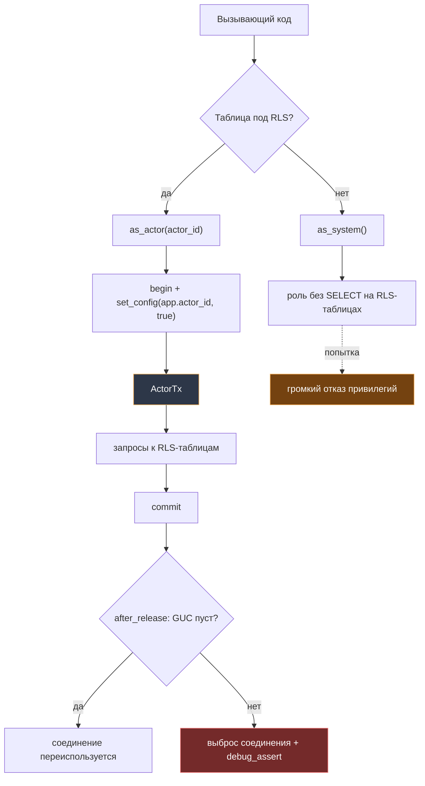
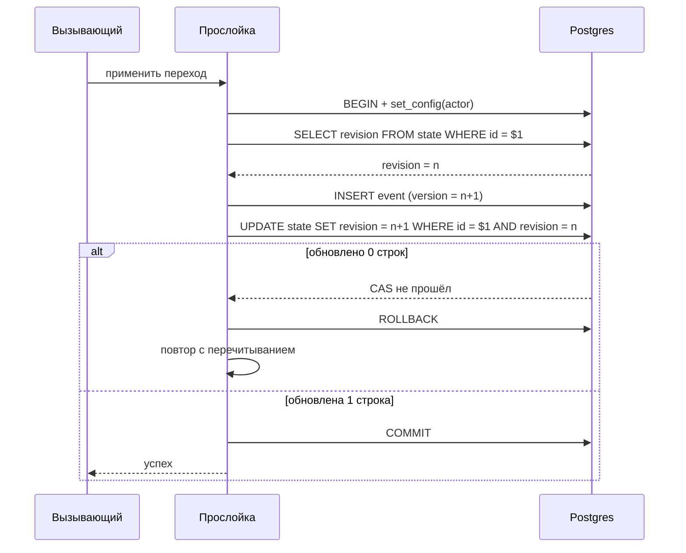
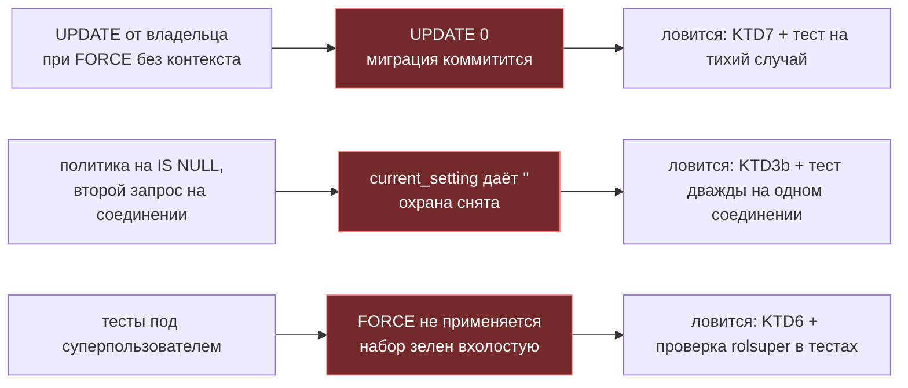

# feat: миграции v1-ядра схемы Гефеста + прослойка доступа с CAS-retry (GF-5)

## Summary

Первая настоящая логика проекта: 11 таблиц + `audit_log`, три роли Postgres, RLS на ядре доставки, прослойка доступа с CAS-retry и подкоманда `hef migrate`.

Цена ошибки выше обычного: миграции forward-only. Поэтому план строится вокруг ловушек, а не вокруг перечисления DDL — и вторая редакция построена вокруг того класса ловушек, который первая пропустила: **отказов, выглядящих как успех**.

Эта редакция переписана после ревью четырьмя ревьюерами (26 находок, 9 уровня P0/P1). Архитектурные решения устояли целиком; развалилась стыковка с реальностью, и почти все правки — оттуда.

---

## Problem Frame

Схема — фундамент, куда стекаются решения всех предыдущих ADR: append-only журналы (ADR-0001), донорские уроки (ADR-0002), канон памяти (ADR-0003), sqlx (ADR-0004), доставка с каузальным `delivered` (ADR-0007), машина состояний сессии (ADR-0008).

Сейчас в репозитории шесть пустых крейтов и CI, ничего содержательного не проверяющий. `sqlx` объявлен в `[workspace.dependencies]`, но не подключён — этот PR и есть момент, когда по правилу H-4 зависимости входят в работу.

**Главная опасность не в DDL, а в тихих отказах.** Их три, и все проверены на живом PG 18.6:

1. `FORCE RLS` заставляет `UPDATE`/`DELETE` от имени владельца возвращать **ноль строк без ошибки** — миграция коммитится, не сделав ничего.
2. `current_setting(name, true)` после первого касания возвращает `''`, а не `NULL`, — политика на `IS NULL` перестаёт охранять со второго запроса на том же соединении.
3. Суперпользователь обходит `FORCE` целиком — набор RLS-тестов под ним зеленеет вхолостую.

Ни один из трёх не проявляется как поломка. Все три проявляются как «работает».

---

## Requirements

| ID | Требование |
|---|---|
| R1 | 11 таблиц: `actors`, `projects`, `project_counters`, `tasks`, `task_events`, `task_statuses`, `commands`, `command_kinds`, `command_deliveries`, `sessions`, `session_events` |
| R2 | `audit_log` — append-only, факт+кто+когда+таблица+PK, без old/new; retention 12 месяцев; **с писателем**, а не пустой каркас |
| R3 | Три роли: `gefest_migrator` (владелец объектов, `CREATEDB`, **без** SUPERUSER и BYPASSRLS), `gefest_app`, `gefest_owner` |
| R4 | RLS с `FORCE` на `sessions`, `session_events`, `commands` — предикат свой у каждой |
| R5 | Прослойка доступа: CAS через `WHERE revision = $n` с retry, единая на все домены |
| R6 | Разделённые оси команд: `execution_state` + append-only `command_deliveries` |
| R7 | Виды команд — lookup-таблица; истина перечисления — Rust-enum, lookup наполняется только миграциями |
| R8 | Lease на `taken`: команда старше 5 минут доступна повторному захвату |
| R9 | Частичные UNIQUE: одна живая команда старта на задачу, одна running-сессия на задачу |
| R10 | Ключ задачи — функцией при INSERT через `FOR UPDATE` счётчика; `projects.key` иммутабелен |
| R11 | `task_events.origin` — trust-дверь D-16: `owner`/`agent`/`agent_external` |
| R12 | Запрет UPDATE/DELETE на журнальных таблицах — триггерами |
| R13 | bigserial PK + бизнес-ключи UNIQUE + UUIDv7 приложением. **Исключение:** lookup-таблицы несут текстовый код как PK |
| R14 | FTS: хранимый `tsvector` с весами на `russian`, GIN-индекс |
| R15 | BRIN на журнальных таблицах, с `autosummarize = on` |
| R16 | Подкоманда `hef migrate` на бинаре `hef`: DSN мигратора только здесь |
| R17 | CI: service-контейнер Postgres, применение миграций, `sqlx prepare --check` |
| R18 | `projects.scope_class` (`personal`/`client`) — признак для fail-loud фильтра приватности ADR-0003 |
| R19 | Ветка и PR; прямой пуш в `main` запрещён |
| R20 | Авторство — Igor Kramar, без упоминаний ИИ |

R19–R20 процессные: выполняются способом ведения работы, а не файлом, и проверяются в Definition of Done.

---

## Key Technical Decisions

### KTD1. Postgres 18 в пине, `STORED` пишется явно везде

Пинится `postgres:18-alpine` (18.6). ADR-0005 п. 11 запрещает специфику PG17 и оставляет путь на 18 свободным.

В PG 18 дефолтный вид генерируемой колонки сменился с `STORED` на `VIRTUAL`. Объявление без явного `STORED` **успешно создаёт таблицу**, а следующая миграция падает на `CREATE INDEX`: `indexes on virtual generated columns are not supported`. Два файла — и серия встала без отката.

Смежная ловушка того же места: одноаргументный `to_tsvector(body)` даёт `generation expression is not immutable` — эта форма лишь STABLE, потому что зависит от `default_text_search_config`. Конфигурация указывается явно всегда.

### KTD2. Сырой пул закрыт по типам; доступ мимо контекста закрыт политикой

Первая редакция утверждала, что «забыть контекст невозможно по типам». Это неправда, и формулировка исправлена: `as_system()` публичен, и через него RLS-таблица достижима. Компилятор этого не ловит.

Что закрыто чем:

| Ошибка | Чем ловится | Как проявляется |
|---|---|---|
| Запрос мимо прослойки, прямо из пула | **Типами**: `PgPool` приватен, функции, принимающей `&PgPool`, не существует | ошибка компиляции |
| Запрос к RLS-таблице через `as_system()` | **Политикой** | тихий ноль строк |

Второй случай именно тихий, и потому `as_system()` получает вторую линию: он подключается ролью, у которой **нет `SELECT`** на трёх RLS-таблицах. Тогда ошибка становится громкой — отказ привилегий вместо пустого результата.

### KTD3a. Предикат политики свой у каждой из трёх таблиц

Первая редакция объявляла одну форму на все три. Она нереализуема: `actor_id` есть только у `sessions`. У `session_events` колонок актора **нет вовсе**, у `commands` их **две с противоположной семантикой**.

| Таблица | Предикат | Почему так |
|---|---|---|
| `sessions` | `actor_id = <актор>` | Колонка есть, семантика однозначна |
| `session_events` | производный: `EXISTS (SELECT 1 FROM sessions s WHERE s.id = session_id AND s.actor_id = <актор>)` | Своего актора нет; видимость наследуется. Родитель под `FORCE`, цепочка остаётся fail-closed |
| `commands` | `issued_by = <актор> OR addressee_id = <актор>` | Обе стороны видят команду **намеренно**: иначе раннер не увидит того, что обязан забрать, а владелец — того, что выдал |

Дизъюнкция в `commands` — решение, а не расширение по ходу: при открытии D-16 её придётся пересматривать вместе с политиками на `tasks`.

Обёртка `(SELECT current_setting(…))` сохраняется — даёт InitPlan-кеширование. Это производительность, но именно с неё обычно начинают «оптимизировать» политику и заканчивают ослаблением.

### KTD3b. Политики — через `nullif(current_setting(…, true), '')`, не через `IS NULL`

`current_setting(name, true)` возвращает `NULL` только до первого касания GUC на соединении. После — пустую строку, **навсегда**; `DISCARD ALL` не отменяет.

Политика на `IS NULL` работает на первом запросе каждого соединения и тихо перестаёт охранять на всех следующих. Форма с равенством fail-closed по построению.

Отрицательный тест «NULL-контекст → пусто» обязан прогоняться **дважды на одном соединении** — иначе он проверяет только первый случай и пропускает ровно тот дефект, ради которого написан.

### KTD4. Сессионно-липкий контекст запрещён во всех формах и сторожится

Первая редакция сторожила третий аргумент `set_config`. Этого мало: `SET app.actor_id = '42'` (плоский `SET`, без `LOCAL`) эквивалентен по последствиям и под тот греп не попадает — проверено, значение переживает COMMIT.

Разница по периметру существенна. В крейтах вторую форму поймает хук `after_release`. В `migrations/**` хука нет: миграции идут через `hef migrate` мимо пула, и плоский `SET` там — работающий способ провести строки мимо `FORCE` от имени мигратора, невидимый ни для одной линии защиты.

Сторож ловит **класс**, а не функцию: третий аргумент `set_config`, не являющийся литералом `true`; `SET`/`SET SESSION` по GUC пространства `app.` (разрешая `SET LOCAL app.`). Каждая форма получает свой красный образец в `guard-selftest.sh` — иначе расширение сторожа само окажется непроверенным.

### KTD5. `#[sqlx::test]` против service-контейнера; testcontainers не заводится

`#[sqlx::test]` создаёт базу на тест, прогоняет миграции, применяет фикстуры. Ключевая для нас сигнатура — `fn(PoolOptions, PgConnectOptions)`: отдаёт параметры подключения **неподключёнными**, что единственно и позволяет проверить RLS от имени разных ролей.

Отвергнуто: **testcontainers** (окупается, когда тестовый бинарь владеет жизненным циклом контейнера — не наш случай); **откат транзакции на тест** (структурно не может проверить главное: роль подключения внутри транзакции не сменить, а вся конструкция стоит на том, что `gefest_app` не владелец).

Не рассмотрено первой редакцией и оставлено как запасной путь: **шаблонная база плюс `CREATE DATABASE … TEMPLATE`**. `#[sqlx::test]` прогоняет всю серию миграций на каждый тест, и оценка «100–300 мс» — нижняя граница; при шестидесяти тестах разница между 200 и 700 мс это разница между 12 и 42 секундами каждого прогона. Замер делается на первом же наборе.

### KTD6. `CREATE ROLE` вне миграций, `GRANT` внутри

Роли — объект уровня кластера. `CREATE ROLE` в forward-only серии проходит один раз и падает на второй базе, а в режиме «база на тест» протекает между тестами.

`gefest_migrator` создаётся с `LOGIN CREATEDB` и **без** SUPERUSER и BYPASSRLS. Это не деталь: проверено, что суперпользователь обходит `FORCE` целиком — под ним RLS-тесты зеленеют, ничего не проверяя.

### KTD7. Запись в RLS-таблицу вне `ActorTx` требует явной обёртки

Первая редакция знала только громкий отказ: `FORCE` не даёт владельцу вставить строку, миграция падает. Правило было сформулировано как «сев до `FORCE` внутри одной миграции».

**В этой серии такой случай не наступает ни разу** — RLS включается в `0006` на таблицах из `0003`/`0004`. Зато наступает случай, который первая редакция не знала.

Проверено на PG 18.6: владелец таблицы при `FORCE` и без actor-контекста получает на `UPDATE` — `UPDATE 0`, на `DELETE` — `DELETE 0`, и **миграция успешно коммитится**. `SET row_security = off` владельцу не помогает: `ERROR: query would be affected by row-level security policy`.

План сам называет трёх будущих потребителей этого случая: волна 2 forward-миграциями, партиционирование журналов с переносом данных, janitor с retention и batched-DELETE. Forward-only означает, что такая миграция пометится применённой, а повторить её нечем.

Правило поэтому шире: **любая запись в `sessions`, `session_events` или `commands` мимо `ActorTx`** несёт одну из двух обёрток — `ALTER TABLE … NO FORCE` в начале файла с возвратом `FORCE` в конце, либо явный `set_config('app.actor_id', …, true)` в самой миграции. Это сторожится (U7) и проверяется тестом именно на тихий случай (U6).

### KTD8. BRIN создаётся с `autosummarize = on`

Не дефолт, и цена пропуска замерена: на журнале в 3.4 млн строк запрос по часовому окну читал 256 блоков при просуммированном индексе и **6851 после 500 тысяч непросуммированных вставок**.

Форма отказа коварна: замедлился запрос по **старым** данным — непросуммированные диапазоны BRIN обязан считать подходящими под любое условие. Автовакуум приходит к append-only таблице неохотно.

Для сравнения на том же журнале: BRIN — 32 кБ, btree по той же колонке — 64 МБ. `pages_per_range` остаётся дефолтным.

### KTD9. Ключ задачи присваивается функцией *(эскиз правится решением)*

Эскиз (design §2) объявляет `key GENERATED`. Решение (decision ред. 2, п. 4) отменяет: присвоение функцией при INSERT через `SELECT next_seq … FOR UPDATE`.

Причина: `GENERATED` не может ссылаться на другую таблицу, а `project.key` живёт в `projects`. Расхождение внутри пары документов разрешается в пользу решения — оно новее и принято после roast.

Строку счётчика заводит `AFTER INSERT` триггер на `projects`. Без него функция ключа получит ноль строк на первом же проекте, созданном через API, — а тесты этого не поймают, потому что готовят счётчик руками.

### KTD10. RLS не включается на `tasks` *(расхождение с принятой поправкой CC-7)*

Поправка 8 решения (CC-7) явно расширяет перечень RLS на `observations` и `tasks`. Наше сужение это отменяет — в части `tasks`; `observations` в волну 1 не входит вовсе и здесь не решается.

**Разделяющий критерий, которого первая редакция не назвала:** политика держится там, куда пишет раннер от имени актора, — `sessions`, `session_events`, `commands`. Аргумент «агенты к БД не подключаются» верен и для этих трёх, поэтому сам по себе он ничего не разделяет. Разделяет то, что у трёх таблиц есть актор-владелец строки, а у `tasks` его нет.

**Стоимость возврата названа честно и она выше, чем «одна миграция»:** колонка актора в `tasks` с заполнением истории из `task_events`; ревизия всех путей чтения `tasks`, написанных к тому моменту через `as_system()` — включение политики превратит их в тихие нули строк, а не в ошибки; само заполнение колонки упирается в KTD7.

### KTD11. `SQLX_OFFLINE=true` — умолчание репозитория, **без `force`**

Макросы предпочитают живое описание схемы кэшу, когда виден `DATABASE_URL`; разработчик с локальной базой не замечает расхождения `.sqlx`, и ловит его только CI.

**Форма записывается буквально:** `[env] SQLX_OFFLINE = "true"` без `force = true`. Причина проверена: `cargo sqlx prepare` сам выставляет дочернему процессу `SQLX_OFFLINE=false`, и не-force значение из конфига ему уступает. С `force = true` — а это очень естественная запись при чтении «умолчание репозитория» — `prepare` уходит в офлайн и `prepare --check` становится вечнозелёным против устаревшего кэша.

Правка отменяет действующий запрет в `crates/db/README.md` (пункт 2 раздела «Чего делать нельзя»): запрет теперь про `.env`, а не про репозиторное умолчание. README правится тем же PR.

### KTD12. `sqlx-cli` в CI ставит mise — в одном job-е

Предыдущий PR отключил автоустановку инструментов (`install_args: rust` плюс `MISE_TASK_RUN_AUTO_INSTALL: 'false'`), чтобы `sqlx-cli` не собирался из исходников на раннере. Решение было правильным и остаётся; изменилось то, что появился шаг, которому этот бинарь нужен.

Канал поставки: `MISE_TASK_RUN_AUTO_INSTALL` переопределяется на `true` **на уровне job-а с базой**, и только там. Версия уже запинена в `mise.toml`, поверхность ограничена одним job-ом, а цена сборки платится там, где и так поднимается Postgres.

Отвергнуто: `cargo install --locked sqlx-cli` — не работает, `Cargo.lock` убран из репозитория sqlx; тянуть бинарь релиза — добавляет второй канал поставки к уже существующему mise-пину.

### KTD13. Офлайн-гейты и гейты с базой разведены

`#[sqlx::test]` без `DATABASE_URL` не пропускает тест, а паникует. Значит после этого PR `cargo test --workspace` перестаёт быть офлайн-проверкой — а `mise run test` входит в `[tasks.ci]`, описанную как «все проверки, доступные без внешних ресурсов».

Практическое следствие сильнее косметики: агент в контейнере задачи по ADR-0006 не имеет ни базы, ни секретов. Оставить как есть — значит лишить его возможности прогнать `mise run ci` целиком: тот самый «сторож против невозможности», от которого репозиторий отказался письменно.

Разведение: `test` остаётся офлайн (`--exclude hef-db`), новая `test:db` требует базы и вызывается отдельным шагом CI рядом с service-контейнером.

---

## High-Level Technical Design

### Путь запроса и то, чем ловится каждая ошибка



Сырой `PgPool` приватен — левая ветка единственная по типам. Правая ветка закрыта не типами, а привилегиями роли: без этого обращение к RLS-таблице через `as_system()` давало бы тихий ноль строк.

### Переход состояния: событие и состояние одной транзакцией



Порядок версий защищает **сам CAS**: `version = revision + 1` вычисляется в той же транзакции, что и проверка `revision`. Отдельного триггера порядка версий эта волна не заводит — первая редакция упоминала его в подписи, не создавая ни в одном юните.

### Три места, где отказ выглядит как успех



---

## Output Structure

```
.cargo/
└── config.toml                 # SQLX_OFFLINE=true без force (KTD11)
.sqlx/                          # кэш запросов, коммитится; генерируется в U7
crates/core/src/
├── lib.rs
└── enums.rs                    # перечисления-истина
crates/db/
├── Cargo.toml                  # sqlx, uuid (v7), hef-core с фичой sqlx
├── migrations/
│   ├── 0001_lookup_and_identity.sql
│   ├── 0002_projects_and_tasks.sql
│   ├── 0003_sessions.sql
│   ├── 0004_commands.sql
│   ├── 0005_audit_log.sql
│   └── 0006_rls.sql
├── README.md                   # runbook: правится под KTD11
├── src/{lib,pool,cas,ids}.rs
└── tests/{rls,fts,invariants,enums}.rs
crates/hef/
├── Cargo.toml                  # clap, hef-db
└── src/main.rs                 # подкоманда migrate (U9)
infra/dev/
├── docker-compose.yml          # Postgres 18, порт 5434
└── bootstrap-roles.sh          # .sh, а не .sql — psql не видит env (U1)
scripts/
└── guard-set-config.sh         # класс сессионно-липкого контекста
```

---

## Implementation Units

### U1. Локальное окружение: Postgres, роли, офлайн-умолчание

**Goal.** Одинаковый способ поднять базу локально и в CI; роли с правильными атрибутами.

**Requirements.** R3, R17; KTD1, KTD6, KTD11.

**Dependencies.** Нет.

**Files.**
- `infra/dev/docker-compose.yml` (создать)
- `infra/dev/bootstrap-roles.sh` (создать)
- `mise.toml` (изменить — задачи `db:up`, `db:down`, `db:reset`)
- `.cargo/config.toml` (создать)
- `.env.example` (создать)

**Approach.**
1. Compose поднимает `postgres:18-alpine` на порту **5434**: 5432 и 5433 заняты соседними проектами (проверено).
2. **Bootstrap — `.sh`, а не `.sql`.** Проверено: `.sql` в `docker-entrypoint-initdb.d` исполняется psql, который **не разворачивает переменные окружения** — `CREATE ROLE … PASSWORD '${APP_PW}'` отрабатывает без ошибки и создаёт роль с паролем-литералом `${APP_PW}`. Отладка этого приводит прямиком к вписыванию пароля в файл, который лежит в git. Скрипт `.sh` окружение видит; пароль передаётся через `psql -v`, в файле его нет никогда.
3. `gefest_migrator` — `LOGIN CREATEDB`, **без** SUPERUSER и BYPASSRLS (KTD6). `CREATEDB` обязателен: без него `#[sqlx::test]` не создаст базу на тест.
4. `.cargo/config.toml`: `[env] SQLX_OFFLINE = "true"` **без `force`**, с комментарием, почему `force = true` ломает `prepare --check` (KTD11).

**Test scenarios.**
- `mise run db:up` на чистой машине поднимает контейнер и дожидается готовности; повторный вызов не падает.
- Три роли существуют после первого подъёма; `gefest_migrator` имеет `rolcreatedb = true` и `rolsuper = false`, `rolbypassrls = false` — проверяется запросом к `pg_roles`.
- В `infra/**` нет строкового литерала после `PASSWORD` — пароль не попал в файл.
- Порт 5434 не конфликтует: все три контейнера живут одновременно.
- `.cargo/config.toml` не содержит `force` — grep как регрессионная проверка.

**Verification.** База поднимается, роли имеют заданные атрибуты, пароль не в репозитории.

---

### U2. Перечисления-истина в `hef-core`

**Goal.** Rust-enum как источник истины для значений, зеркалимых lookup-таблицами.

**Requirements.** R7, R11.

**Dependencies.** U1.

**Files.**
- `crates/core/src/enums.rs` (создать)
- `crates/core/src/lib.rs` (изменить — экспорт)

**Approach.**
1. Перечисления: вид команды, статус задачи, состояние сессии, вид события сессии, исход доставки, происхождение события задачи (R11).
2. Каждое умеет отдать строковый код и перечислить все варианты — это нужно тесту синхронизации U8.
3. **Дефолтный граф `hef-core` остаётся пустым**, `Cargo.toml` крейта не меняется: перечислениям не нужен ни `uuid`, ни что-либо ещё. UUIDv7 живёт в `crates/db` (U7). Сторож `guard:core-graph` не трогается.

**Test scenarios.**
- Строковые коды зафиксированы буквально — переименование не пройдёт молча.
- Перечень вариантов не пуст и без дубликатов.
- `mise run guard:core-graph` остаётся зелёным.

**Verification.** `cargo test -p hef-core` зелёный; граф `core` не изменился.

---

### U3. Миграции: lookup, identity, проекты и задачи

**Goal.** Первые таблицы, ключ задачи через функцию, признак приватности проекта.

**Requirements.** R1, R7, R10, R11, R12, R13, R15, R18; KTD1, KTD8, KTD9.

**Dependencies.** U1, U2.

**Files.**
- `crates/db/migrations/0001_lookup_and_identity.sql` (создать)
- `crates/db/migrations/0002_projects_and_tasks.sql` (создать)
- `crates/db/Cargo.toml` (изменить — `sqlx`, `hef-core` с фичой `sqlx`)

**Approach.**
1. `0001`: `command_kinds`, `task_statuses`, `actors`. **Lookup-таблицы несут текстовый код как PK** (R13, исключение): предикат частичного UNIQUE обязан быть IMMUTABLE и потому называет вид команды литералом. При bigserial-суррогате этот литерал — число, зависящее от порядка сева, и правка порядка INSERT-ов молча меняет смысл индекса.
2. `0002`: `projects`, `project_counters`, `tasks`, `task_events`.
   - `projects.key` иммутабелен — триггер на UPDATE ключа.
   - **`projects.scope_class`** (`personal`/`client`), `NOT NULL`, **без DEFAULT** (R18): класс называется при заведении. На нём держится fail-loud фильтр приватности ADR-0003. Сам фильтр приходит в Ф2, но колонка заводится сейчас: ретрофит требует ручной классификации накопленного, причём безопасный дефолт сломает всё, что на фильтр опирается, а удобный — молча раскроет.
   - **`AFTER INSERT` триггер на `projects`** заводит строку `project_counters` (KTD9). Без него функция ключа получит ноль строк на первом же проекте из API.
3. Ключ задачи — функцией при INSERT, не `GENERATED` (KTD9).
4. `task_events` — append-only триггером (R12); BRIN с `autosummarize = on` (KTD8, R15).
5. Генерируемые колонки — с явным `STORED` (KTD1).

**Execution note.** Каждая миграция применяется на чистую базу отдельно, прежде чем писать следующую: forward-only не прощает «допишу потом».

**Test scenarios.**
- Миграции применяются на чистую базу; повторный прогон ничего не делает.
- Задача **в только что созданном проекте** получает `GF-1` без ручной подготовки счётчика — прямая проверка триггера из п. 2.
- Следующая задача получает `GF-2`.
- Две вставки задач в один проект **на разных соединениях с реальным перекрытием транзакций** получают разные ключи. Последовательный вариант на одном соединении прошёл бы и без `FOR UPDATE` — он ничего не проверяет.
- `UPDATE` `projects.key` отклоняется триггером.
- `UPDATE` и `DELETE` на `task_events` отклоняются.
- Проект без `scope_class` не создаётся; значение вне двух вариантов отклоняется.
- Runtime-`INSERT` в `task_statuses` отклоняется (R7).
- `task_events.origin` принимает ровно три варианта.

**Verification.** Схема поднимается, ключи присваиваются с первого проекта, журнал неизменяем.

---

### U4. Миграции: сессии с FTS и журналом

**Goal.** `sessions` и `session_events` с полнотекстовым поиском.

**Requirements.** R1, R9, R12, R13, R14, R15; KTD1, KTD8.

**Dependencies.** U3.

**Files.**
- `crates/db/migrations/0003_sessions.sql` (создать)

**Approach.**
1. `sessions`: состояние по перечислению U2, `claude_session_id`, `raw_path`, `raw_state`, `usage` jsonb, `revision` для CAS.
2. `summary_tsv` — генерируемая **с явным `STORED`** и **двухаргументным** `to_tsvector('russian', …)` (KTD1). Веса через `setweight`. GIN с `fastupdate = off`: предсказуемая задержка чтения важнее пропускной способности записи при одном операторе.
3. `session_events`: append-only триггером, BRIN с `autosummarize = on`, ключ будущего партиционирования в PK заранее.
4. Частичный UNIQUE: одна running-сессия на задачу (R9).

**Test scenarios.**
- Русская словоформа находится по другой форме: «контейнеры» по «контейнер».
- Английский термин в русском тексте находится: `rootless` в корпусе, запрос по `rootless` попадает.
- `ts_debug('russian', …)` на корпусе из 20 текстов даёт ожидаемые словари: `asciiword` → `english_stem`, `word` → `russian_stem`.
- `set_config` лексится как два токена и находится фразовым запросом — поведение фиксируется, чтобы не удивляться потом.
- Вторая running-сессия на ту же задачу отклоняется.
- `UPDATE` на `session_events` отклоняется.
- **Индекс на `summary_tsv` создаётся успешно** — прямая проверка, что колонка `STORED`, а не `VIRTUAL`.

**Verification.** Поиск находит русские словоформы и английские термины; журнал неизменяем.

---

### U5. Миграции: команды, доставка, lease

**Goal.** Разделённые оси команды и append-only история доставки.

**Requirements.** R1, R6, R8, R9, R12, R13, R15; KTD8.

**Dependencies.** U4.

**Files.**
- `crates/db/migrations/0004_commands.sql` (создать)

**Approach.**
1. `commands`: `execution_state` как ось исполнения, `kind` — FK на `command_kinds` (текстовый код, U3), `uuid7` UNIQUE наружу, `revision`, `taken_at`.
2. `command_deliveries` — append-only история попыток; текущий исход выводится последней записью (R6).
3. Lease (R8): частичный индекс по живым состояниям; повторный захват через `taken_at < now() - interval '5 minutes'`.
4. Идемпотентность (R9): частичный UNIQUE — одна живая команда старта на задачу. Читается как `WHERE kind = 'session_start' AND execution_state IN (…)` благодаря текстовому коду.
5. BRIN с `autosummarize = on` на `command_deliveries`.

**Test scenarios.**
- Захват переводит команду в `taken` и проставляет `taken_at`; повторный захват не проходит.
- Команда в `taken` старше пяти минут доступна повторному захвату; моложе — нет.
- Вторая живая команда старта на ту же задачу отклоняется.
- Команда старта на задачу с уже завершённой предыдущей проходит — частичный UNIQUE не мешает нормальному потоку.
- `UPDATE` и `DELETE` на `command_deliveries` отклоняются.
- Вид команды вне `command_kinds` отклоняется внешним ключом.

**Verification.** Захват, lease и идемпотентность ведут себя по ADR-0007.

---

### U6. Миграции: `audit_log`, права и RLS

**Goal.** Права выданы поимённо, три таблицы под политиками, аудит с живым писателем.

**Requirements.** R2, R3, R4, R12; KTD3a, KTD3b, KTD7, KTD10.

**Dependencies.** U5.

**Files.**
- `crates/db/migrations/0005_audit_log.sql` (создать)
- `crates/db/migrations/0006_rls.sql` (создать)

**Approach.**
1. `audit_log`: факт, актор, время, таблица, PK строки — **без old/new**. Append-only, retention 12 месяцев.
   **Писатель называется здесь, иначе таблица останется пустой навсегда.** Пишет триггерная функция `SECURITY DEFINER` во владении `gefest_migrator` с фиксированным `search_path`: `gefest_app` не нуждается в `INSERT` на `audit_log` и не может подделать строку. Навешивается на state-таблицы `tasks`, `sessions`, `commands` — на `UPDATE`/`DELETE`, пришедшие не от `gefest_app` либо без `app.actor_id`. Писать аудит **приложением нельзя**: он стал бы дочерним тому пути, обход которого фиксирует.
2. `GRANT` — **поимённо, без `ALL`**. Причина проверена: `TRUNCATE` не вызывает построчных триггеров и не подчиняется политикам, он ограничен только привилегией. Одна строка `GRANT ALL` отдала бы роли приложения возможность стереть `session_events`, `command_deliveries` и сам `audit_log` дочиста, мимо обеих защит.
   - `gefest_app`: `SELECT, INSERT, UPDATE` на state-таблицах; `SELECT, INSERT` на журнальных; `SELECT` на lookup; `USAGE` на последовательностях.
   - `gefest_owner`: `SELECT` в объёме своей политики. **`SELECT` на трёх RLS-таблицах не выдаётся роли `as_system()`** (KTD2) — это и делает обращение мимо контекста громким.
   - `TRUNCATE` не выдаётся никому, кроме владельца.
   - Первой строкой: `REVOKE ALL ON SCHEMA public FROM PUBLIC` и `REVOKE ALL ON ALL TABLES … FROM PUBLIC`.
3. RLS + `FORCE` ровно на `sessions`, `session_events`, `commands`; на `tasks`/`projects` — нет (KTD10).
4. Предикаты — свои у каждой таблицы (KTD3a), через `nullif(current_setting(…, true), '')` (KTD3b).
5. **Политика `gefest_owner` задаётся явно**: `FOR SELECT TO gefest_owner USING (true)` — владелец видит всё, но не владеет объектами и не пишет. Неназванный объём чинится в консоли самой широкой политикой под отладку и остаётся навсегда.
6. Порядок внутри файла: права → `ENABLE` → `FORCE` → `CREATE POLICY`. Политика без `ENABLE` неактивна, `ENABLE` без политики отсекает всё — промежуточное состояние внутри одной транзакции безопасно в обе стороны, но порядок фиксируется, чтобы его не выбирали заново при каждой следующей RLS-таблице.

**Execution note.** Один раз намеренно нарушить порядок в черновике и увидеть `new row violates row-level security policy` от имени мигратора — чтобы узнать это сообщение в лицо, когда оно встретится в следующей миграции.

**Test scenarios.**
- Владелец таблиц — `gefest_migrator`; `gefest_app` не владелец. Проверяется системным каталогом.
- От имени `gefest_app` с контекстом видны только свои строки — **отдельно для каждой из трёх таблиц**: `sessions` по своему актору, `session_events` через чужую родительскую сессию, `commands` с обеих сторон (`issued_by` и `addressee_id`).
- Запрос без контекста возвращает пусто.
- **Тот же запрос вторым на том же соединении тоже возвращает пусто** — прямая проверка ловушки `''`-вместо-`NULL` (KTD3b).
- **`UPDATE` по RLS-таблице от мигратора без контекста возвращает 0 строк и не падает** — проверка тихого случая KTD7, ради которого правило и расширено.
- `gefest_owner` видит строки в объёме своей политики.
- `TRUNCATE audit_log` и `TRUNCATE session_events` от имени `gefest_app` отклоняются.
- Прямой `UPDATE` state-таблицы от владельца оставляет ровно одну строку в `audit_log` с ожидаемыми `table_name` и `row_pk` — положительный тест аудита, без которого таблица считалась бы работающей будучи пустой.
- `UPDATE` на `audit_log` отклоняется.

**Verification.** Роли не владеют таблицами; каждая политика проверена на своей таблице; аудит доказанно пишет.

---

### U7. Прослойка доступа, идентификаторы и сторож контекста

**Goal.** CAS-протокол, типовая граница пула, сторож сессионно-липкого контекста.

**Requirements.** R5, R13; KTD2, KTD4.

**Dependencies.** U6.

**Files.**
- `crates/db/src/pool.rs` (создать)
- `crates/db/src/cas.rs` (создать)
- `crates/db/src/ids.rs` (создать)
- `crates/db/src/lib.rs` (изменить)
- `crates/db/Cargo.toml` (изменить — **добавить `uuid = { version = "1.25", features = ["v7"] }`**)
- `scripts/guard-set-config.sh` (создать)
- `scripts/guard-selftest.sh` (изменить — красные образцы обеих форм)
- `mise.toml` (изменить — задача `guard:set-config`, включить в `ci`)
- `.github/workflows/ci.yml` (изменить — шаг нового сторожа)
- `.sqlx/` (создать — генерируется `mise run sqlx:prepare` против локальной базы и коммитится)

**Approach.**
1. `ActorTx` — обёртка над транзакцией; единственный конструктор выставляет контекст. `PgPool` приватен.
2. `as_system()` — отдельный явно названный путь, подключающийся ролью без `SELECT` на RLS-таблицах (KTD2). Именование важно: «system» читается как решение, а `as_actor(None)` читалось бы как забывчивость.
3. CAS: перечитать `revision`, вставить событие с `version = revision + 1`, обновить state с условием, при нуле обновлённых строк — повтор с ограничением попыток и явной ошибкой при исчерпании.
4. UUIDv7 приложением (`Uuid::now_v7()`); зависимость добавляется здесь же.
5. Хук `after_release`: GUC пуст — иначе соединение выбрасывается, в debug-сборке падает `debug_assert`.
6. Сторож ловит **класс** (KTD4): не-литеральный третий аргумент `set_config`, плоский `SET app.*` без `LOCAL`. Область — `crates/**` и `migrations/**`. Добавляется в `guard-selftest.sh` тем же изменением, по правилу репозитория.
7. `.sqlx` генерируется против локальной базы и коммитится: с `SQLX_OFFLINE=true` по умолчанию (KTD11) кэш обязателен для любой сборки, включая агента без базы.

**Execution note.** Сторожа писать от красного, по каждой форме отдельно: внести `set_config(…, false)`, убедиться, что падает и называет файл; затем внести `SET app.actor_id = '1'` и убедиться, что падает снова. Одна форма из двух — сторож, покрывающий половину класса и читающийся как покрывающий весь.

**Test scenarios.**
- Публичный API крейта не содержит функции, принимающей `&PgPool` — проверяется ревизией экспортов (компиляционный тест хрупок, см. Open Questions).
- **Обращение к RLS-таблице через `as_system()` даёт громкий отказ привилегий**, а не пустой результат — проверка второй линии KTD2.
- CAS-повтор: два конкурирующих перехода на одной строке — один проходит, второй перечитывает и повторяет; событий ровно два с последовательными версиями.
- CAS исчерпывает попытки и возвращает внятную ошибку, а не зацикливается.
- **`after_release` с наблюдаемым признаком:** пул на одно соединение, запомнить `pg_backend_pid()`, выставить не-LOCAL контекст, вернуть соединение, взять снова — PID изменился. Контрольный прогон без грязного GUC обязан дать **тот же** PID: иначе тест не различает работу хука от обычной ротации пула.
- `guard:set-config` красный на `set_config(…, false)` и красный на плоском `SET app.actor_id` — обе формы.
- UUIDv7 подряд монотонно возрастают.

**Verification.** Прослойка не даёт тихого доступа мимо контекста; конкурентные переходы сходятся; сторож краснеет на обеих формах.

---

### U8. Тесты схемы и CI с базой

**Goal.** Всё проверяется машинно, в CI, на чистой базе; офлайн-гейты остаются офлайн.

**Requirements.** R7, R17; KTD5, KTD12, KTD13.

**Dependencies.** U7.

**Files.**
- `crates/db/tests/rls.rs` (создать)
- `crates/db/tests/fts.rs` (создать)
- `crates/db/tests/invariants.rs` (создать)
- `crates/db/tests/enums.rs` (создать)
- `mise.toml` (изменить — `test` с `--exclude hef-db`, новая `test:db`)
- `.github/workflows/ci.yml` (изменить — service-контейнер, роли, миграции, `prepare --check`, `test:db`)
- `crates/db/README.md` (изменить — пункт про `SQLX_OFFLINE` под KTD11)

**Approach.**
1. Тесты на `#[sqlx::test]`; мультиролевые — через сигнатуру `(PoolOptions, PgConnectOptions)` (KTD5).
2. **`DATABASE_URL` тестов указывает на `gefest_migrator`** — он же становится владельцем таблиц в каждой тестовой базе, потому что `#[sqlx::test]` прогоняет миграции своим соединением. Указание на суперпользователя обесценило бы весь набор RLS-тестов (KTD6).
3. **Первым делом в `rls.rs` — проверка `rolsuper` и `rolbypassrls` текущей роли.** Без неё весь RLS-набор может молча стать пустым.
4. **Посев данных в RLS-таблицы** идёт через `as_actor(...)`, а fixture-файлы начинаются со `SELECT set_config('app.actor_id', '<id>', true)`. Проверено: многооператорный файл уходит одним batch, то есть одной неявной транзакцией, и LOCAL-значение держится до конца файла. Без этого почти каждый тест U4/U5/U7 упрётся в `FORCE`.
5. Тест синхронизации: множество вариантов Rust-enum сравнивается с lookup-таблицей; расхождение в любую сторону — провал.
6. Пароли `gefest_app`/`gefest_owner` приходят в тесты переменными окружения, в CI задаются рядом с созданием ролей.
7. **CI-порядок обязателен:** поднять сервис → создать роли → **применить миграции** → `prepare --check` → `test:db`. `prepare --check` описывает запросы против живого каталога, поэтому без применённых миграций бессмыслен.
8. **`MISE_TASK_RUN_AUTO_INSTALL: 'true'` переопределяется на уровне этого job-а** (KTD12) — иначе `sqlx-cli` на раннере нет и шаг `prepare --check` невыполним.
9. Разведение гейтов (KTD13): `test` — офлайн, `test:db` — рядом с сервисом.

**Execution note.** `prepare --check` форсирует перекомпиляцию, трогая mtime исходников: кэш на этом шаге не спасает — это ожидаемо, а не поломка.

**Test scenarios.**
- Полный прогон на чистой базе: миграции применяются, тесты зелёные.
- `prepare --check` проходит на согласованном `.sqlx` и падает при изменённом тексте запроса без регенерации. Красный прогоняется через `mise run sqlx:check`, а не `cargo check`: обезвреженная форма `[env]` проявится только так.
- Тест синхронизации падает при варианте в enum без строки в lookup — и в обратную сторону.
- `mise run test` **зелёный без запущенной базы** — офлайновость сохранена (KTD13).
- `guard:sqlx-step` зелёный (шаг `prepare --check` в `ci.yml`) и красный при его удалении.
- CI на PR, меняющем только `docs/**`, зелёный по всем пяти job-ам — фильтрация не сломана добавлением сервиса.

**Verification.** CI поднимает базу, применяет миграции, сверяет `.sqlx`, гоняет тесты; офлайн-гейты работают без базы.

---

### U9. Подкоманда `hef migrate`

**Goal.** Миграции применяются бинарём проекта, а не внешним инструментом.

**Requirements.** R16.

**Dependencies.** U7.

**Files.**
- `crates/hef/Cargo.toml` (изменить — `clap`, `hef-db`)
- `crates/hef/src/main.rs` (изменить — подкоманды)
- `crates/db/src/lib.rs` (изменить — экспорт функции применения миграций)
- `mise.toml` (изменить — задача `migrate` вызывает `hef migrate`)

**Approach.**
1. Первая реальная подкоманда бинаря: `hef migrate` применяет встроенную серию (`sqlx::migrate!`), DSN мигратора берётся из окружения и используется **только здесь** (R16).
2. Юнит существует отдельно, потому что первая редакция плана цитировала R16 в U1, а создавала лишь mise-задачу: требование значилось покрытым, не будучи реализованным. Подкоманд clap в `crates/hef` до сих пор нет.
3. Задача `mise run migrate` переключается на `hef migrate` — один путь применения и локально, и в compose (ADR-0005 п. 10).

**Test scenarios.**
- `hef migrate` на чистой базе применяет все шесть миграций; повторный вызов ничего не делает и завершается успешно.
- `hef migrate` без `DATABASE_URL` завершается внятной ошибкой, а не паникой.
- `hef --help` показывает подкоманду `migrate`.
- Бинарь собирается в дефолтной конфигурации workspace — подкоманда не тянет в `hef` серверных зависимостей.

**Verification.** Миграции применяются бинарём; mise-задача — тонкая обёртка над ним.

---

## Verification Contract

| Гейт | Команда | Требует базу | Ловит |
|---|---|---|---|
| Сборка | `mise run build` | нет | Ошибки типов и манифестов |
| Тесты (офлайн) | `mise run test` | нет | Регрессии вне `hef-db` |
| Формат | `mise run fmt:check` | нет | Расхождение форматирования |
| Линт | `mise run lint` | нет | Предупреждения clippy как ошибки |
| Граф `core` | `mise run guard:core-graph` | нет | Загрязнение дефолтного графа |
| Пин тулчейна | `mise run guard:toolchain-pin` | нет | Дрейф версии Rust |
| Растяжка sqlx | `mise run guard:sqlx-step` | нет | `query!` без шага `prepare --check` |
| Липкий контекст | `mise run guard:set-config` | нет | `set_config(…, false)` и плоский `SET app.*` |
| Самопроверка сторожей | `mise run guard:selftest` | нет | Сторож, потерявший способность краснеть |
| **Тесты схемы** | `mise run test:db` | **да** | RLS, FTS, инварианты, синхронность перечислений |
| **Синхронность `.sqlx`** | `mise run sqlx:check` | **да** | Расхождение кэша запросов со схемой |

Девять гейтов офлайн — их полностью проходит агент в контейнере задачи. Два требуют базы: локально её даёт `mise run db:up`, в CI — service-контейнер.

---

## Scope Boundaries

### В объёме

R1–R20.

### Deferred to Follow-Up Work

- **Волна 2:** `consumer_offsets`, `journal`, `roles_profile` — каждая со своим потребителем.
- **Политики RLS на `tasks`** — со вторым оператором либо с D-16; стоимость возврата названа в KTD10 и она выше одной миграции.
- **`observations`** — не входит в волну 1 и здесь не решается, хотя поправка CC-7 упоминает её рядом с `tasks`.
- **Механизм `pg_dump`/restore** — приходит с первой базой, где есть данные. Пока база одна и она dev, ответ на ошибку миграции — `db:reset`; заявлять restore как действующий механизм преждевременно.
- **Retention и janitor** (`audit_log` 12 месяцев, вехи 90 дней) — GF-2. Решение о роли, которой janitor удаляет строки, принимается **до** его написания: при `FORCE` без контекста batched-DELETE отработает как `DELETE 0` без ошибки (KTD7).
- **Партиционирование журналов** — ключ в PK заранее, разбиение по факту роста.
- **`memory_*`** — Ф2 по плану ADR-0003.
- **Фича `sqlx-toml`** — вместе с первым `sqlx.toml`, если появится; без неё файл молча игнорируется.
- **Шаблонная база для тестов** (`CREATE DATABASE … TEMPLATE`) — если замер покажет, что полный прогон миграций на тест дорог (KTD5).

### Вне объёма

- `pgvector` — дверь ADR-0003 с наблюдаемым триггером.
- Специфика PG17 — запрещена ADR-0005 п. 11.

---

## Assumptions

1. **Postgres 18** (`postgres:18-alpine`). Соседние проекты на 17.10; специфика ни той, ни другой версии не используется.
2. **Порт 5434** — 5432 и 5433 заняты (проверено).
3. **Шесть файлов миграций** по доменам: forward-only серия падает целиком, мелкое дробление сужает область разбора.
4. **Имя ветки** — `feat/gf-5-migracii-v1-yadra`.
5. **Одним PR, не двумя.** Разрез по границе `query!` (U1–U6 против U7–U9) рассматривался: он дал бы честно-зелёный `guard:sqlx-step` в первой части и снял бы из неё три находки ревью. Отвергнут владельцем — цена в лишнем цикле ревью выше выигрыша.

---

## Open Questions

1. **Компиляционный тест на отсутствие `&PgPool`** может оказаться хрупким; заменяется ревизией экспортов. Выбор делается при реализации, когда видна устойчивость теста.
2. **Число попыток CAS-retry** до отказа — подбирается на конкурентном тесте.
3. **Стоимость `#[sqlx::test]`** — замерить на первом наборе; при боли смотреть в сторону шаблонной базы (KTD5).
4. **Разделение окружений для ролей.** `bootstrap-roles.sh` описан для dev и CI; prod-путь (ADR-0010, pgcrypto, ключ вне БД) с ним не связан. Где проходит граница — решается не здесь, но названо должно быть.

---

## Definition of Done

- `mise run db:up` поднимает базу; `hef migrate` применяет шесть миграций; повторный вызов идемпотентен.
- `mise run test` зелёный **без запущенной базы**; `mise run test:db` зелёный с базой.
- RLS проверена **отдельно на каждой из трёх таблиц**, включая производную политику `session_events` и обе стороны `commands`.
- Отрицательные тесты доказанно отклоняют: UPDATE журнала, вторую живую команду старта, вторую running-сессию, runtime-INSERT в lookup, `TRUNCATE` от роли приложения, запрос без контекста — **дважды на одном соединении**.
- Тихий случай KTD7 покрыт: `UPDATE` от мигратора без контекста возвращает 0 строк и не падает — и тест это фиксирует.
- `audit_log` доказанно пишет: прямой `UPDATE` state-таблицы оставляет строку с верными `table_name` и `row_pk`.
- Роль тестов — `gefest_migrator` без SUPERUSER; проверка `rolsuper` стоит первой в `rls.rs`.
- `guard:set-config` краснеет на обеих формах и включён в `guard:selftest`.
- `.sqlx` закоммичен и согласован со схемой; `prepare --check` в CI проходит.
- PR открыт из ветки; описание называет расхождения KTD9 (эскиз против решения) и KTD10 (отмена части CC-7); упоминаний ИИ нет.

---

## Sources & Research

- `docs/architecture/decisions/0005-shema-dannyh-zhurnal-plus-state.md` — решение и Review trail с сужением от 2026-08-24.
- `docs/architecture/research/2026-08-20-shema-dannyh-design.md` §2 — эскиз схемы.
- `docs/architecture/research/2026-08-20-shema-dannyh-decision.md` ред. 2 §1 — двенадцать поправок, включая п. 4 (ключ функцией) и п. 8 (перечень RLS).
- `docs/solutions/best-practices/storozh-protiv-nevozmozhnosti.md` — почему `prepare --check` вводится вместе с ресурсом для его прохождения, и почему офлайн-гейты остаются офлайн (KTD13).
- `docs/solutions/best-practices/storozh-obyazan-krasnet.md` — почему новый сторож приходит со своей проверкой и почему каждая форма получает красный образец.
- Research 2026-08-24 (эмпирика на живом PG 18.6 и чтение исходников sqlx 0.9): отсутствие сброса состояния в `return_to_pool()`; `''` вместо `NULL` после первого касания GUC; `FORCE` применяется к владельцу; смена дефолта генерируемых колонок на `VIRTUAL` в PG 18; BRIN без `autosummarize` — 27-кратная деградация; четыре сигнатуры `#[sqlx::test]`; порядок шагов `prepare --check`; смешанный русско-английский текст обрабатывается `russian` без настройки.
- Document review 2026-08-24, четыре ревьюера в раздельных контекстах, 26 находок. Проверено ими эмпирически и вошло в эту редакцию: молчаливый `UPDATE 0`/`DELETE 0` от владельца при `FORCE`; обход `FORCE` суперпользователем; `TRUNCATE` мимо триггеров и политик; psql в `initdb.d` не разворачивает переменные окружения; `force = true` в `[env]` обезвреживает `prepare --check`; отсутствие колонки актора у `session_events`.
- Локальная проверка окружения: Postgres 17.10 в двух соседних контейнерах на 5432 и 5433; Docker 29.7.2; `psql` доступен.
